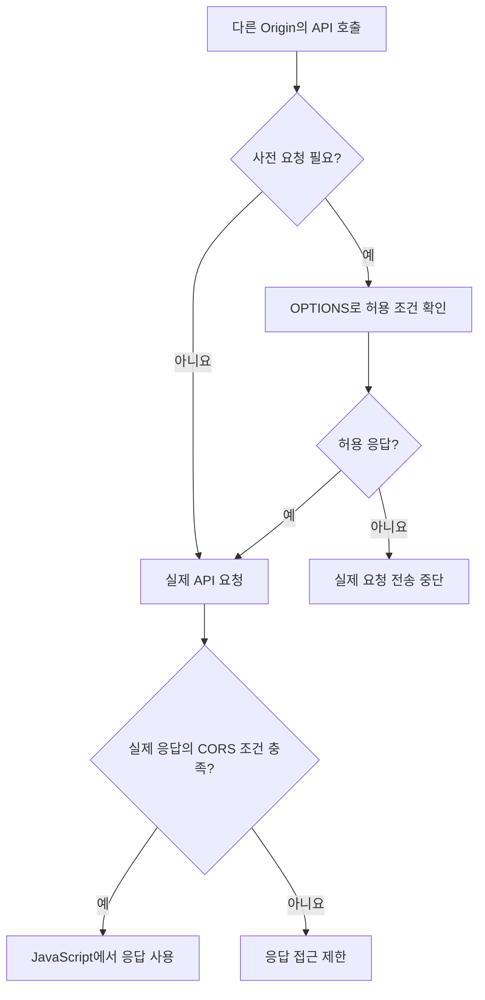

> 📅 **작성일** : 2026-09-02

# 📚 Today I Learned

오늘 학습한 내용을 기록하고 돌아본다.

---

## 🎯 Daily Quest

- [x] 알고리즘 1문제
	- [오늘 푼 문제](https://leetcode.com/problems/construct-uniform-parity-array-i/description/?envType=daily-question&envId=2026-09-02)

**Language** : ☕ Java

---

# 🎯 오늘의 학습 목표

- Swagger의 API 명세를 기준으로 프론트엔드의 요청과 백엔드의 수신·응답 형식을 연결한다.
- 기존 프론트엔드와 백엔드 사이에서 요청이 처리되고 응답 데이터가 화면에 반영되는 흐름을 설명한다.
- CORS의 발생 조건과 서버의 허용 설정을 구분하고, API 연동 문제를 진단하는 기준을 정리한다.

---

# 📌 오늘의 핵심 요약

|주제|핵심 내용|
|---|---|
|Swagger 기반 API 연동|경로·메서드·입력 위치·응답 구조를 확인하고 실제 호출 코드와 맞춘다.|
|요청과 응답의 연결|Controller가 요청을 받아 처리하고, 응답 DTO가 JSON으로 전달되어 프론트에서 사용된다.|
|Origin과 CORS|스킴·호스트·포트가 출처를 결정하며, 브라우저는 서버의 CORS 허용 조건에 따라 응답 접근을 제어한다.|
|오류 확인|API 실행 오류, CORS에 따른 응답 접근 제한, 프론트의 데이터 처리 오류를 구분한다.|

---

# 🔄 오늘 학습 흐름

```text
Swagger에서 API의 입력·출력 약속 확인
    ↓ 요청 형식을 맞춤
기존 프론트엔드와 백엔드의 API 연결
    ↓ 데이터가 이동하는 과정 확인
JSON 응답과 화면 상태의 연결
    ↓ 브라우저에서 발생하는 통신 제약 확인
Origin과 CORS의 동작 원리
    ↓ 허용 조건을 적용
CORS 문제 개선과 연동 결과 확인
```

---

# 📚 학습 내용

> 아래 코드는 연동 원리를 설명하기 위한 예시다. 실제 실습 코드를 옮긴 것은 아니며, 프론트는 `http://localhost:5173`, 백엔드는 `http://localhost:8080`, 조회 경로는 `/products/10`으로 가정한다.

## 1. Swagger를 기준으로 API의 약속 맞추기

### 개념

프론트엔드와 백엔드를 각각 개발했더라도 요청과 응답의 약속이 일치해야 연결할 수 있다. 프론트는 어떤 주소에 어떤 값을 보내야 하는지 알아야 하고, 백엔드는 약속한 형식으로 요청을 받아 응답해야 한다.

**OpenAPI는 HTTP API를 설명하는 명세 형식이고, Swagger UI는 그 명세를 읽고 요청을 실행해 볼 수 있게 하는 도구다.** 일반적인 프론트 요청은 Swagger를 경유하지 않고 실제 백엔드 API로 전달된다. [OpenAPI와 Swagger 공식 문서](https://swagger.io/docs/specification/v3_0/about/)

### 명세에서 확인할 항목

|확인 항목|확인하는 이유|
|---|---|
|서버 주소와 경로|실제 API가 제공되는 서버와 요청 대상을 맞추기 위해|
|HTTP 메서드|같은 경로에서도 조회·등록 등 요청 동작을 구분하기 위해|
|입력 위치|값을 경로·쿼리·헤더·본문 중 어디에 넣는지 맞추기 위해|
|필수값과 자료형|누락된 값이나 변환할 수 없는 값의 전달을 막기 위해|
|응답 구조|객체·배열·공통 응답 포장 중 어떤 형태를 받는지 알기 위해|
|상태 코드|성공과 실패를 어떤 기준으로 처리할지 정하기 위해|

### 동작 흐름

```text
Swagger에서 대상 API 선택
    ↓
경로·메서드·입력 조건 확인
    ↓
필요한 값을 넣어 요청 실행
    ↓
실제 Request URL·상태 코드·응답 본문 확인
    ↓
프론트의 API 호출 코드와 대조
```

예를 들어 상품 상세 API가 다음과 같다고 가정한다.

```http
GET /products/10
```

성공 응답의 본문 예시는 다음과 같다.

```json
{
  "id": 10,
  "productName": "우유"
}
```

프론트에서는 `productName`을 읽어야 한다. `name`이라는 필드를 기대하거나 배열이라고 가정하면, 통신에 성공해도 화면 처리는 실패할 수 있다.

### 주의점

- Swagger의 예시 값과 실제 응답값은 다를 수 있다. 필드 구조와 조건을 함께 확인한다.
- 문서의 경로·상태 코드와 실제 Controller 동작이 일치하는지 확인한다.
- `@ApiResponse`에 상태 코드를 적는 것과 실제로 해당 상태를 반환하는 것은 별개의 작업이다.

### 핵심 포인트

> Swagger에서 확인한 API 명세를 실제 요청과 응답에 맞춰야 한다. URL이 맞는 것만으로 연동이 완성되지는 않는다.

---

## 2. 백엔드의 응답을 프론트 화면까지 연결하기

### 개념

API 명세를 확인했다면, 이제 요청값이 서버에서 처리되고 응답이 화면에 사용되는 과정을 연결한다.

Spring MVC에서는 Controller의 반환값이 HTTP 메시지 변환 과정을 거쳐 응답 본문으로 작성된다. JSON 응답을 구성하는 환경에서는 Java 객체가 JSON으로 직렬화된다. **DB 조회 결과를 Java 객체로 매핑하는 단계와, 그 객체를 HTTP 응답으로 변환하는 단계는 다르다.** [Spring 응답 본문 처리](https://docs.spring.io/spring-framework/reference/web/webmvc/mvc-controller/ann-methods/responsebody.html)

### 동작 흐름

```text
사용자가 상품 조회 동작 실행
    ↓
프론트에서 GET /products/10 요청
    ↓
Controller가 경로의 10을 수신
    ↓
Service가 조회 로직 수행
    ↓
Mapper가 SQL을 실행하여 DB 조회
    ↓
조회 결과를 Java 객체·응답 DTO로 구성
    ↓
HTTP 응답 본문을 JSON으로 작성
    ↓ 브라우저에서 응답 접근이 허용되면
프론트가 JSON을 JavaScript 객체로 변환
    ↓
화면 상태를 갱신하고 상품 정보 표시
```

### 핵심 코드: 백엔드의 요청 수신과 응답 분기

다음은 **Spring MVC Controller 설명용 예시**다. `ProductService`는 기존에 구현된 Bean이며, `findById(Long id)`가 `Optional<ProductResponse>`를 반환한다고 가정한다. 패키지와 import는 생략했다.

```java
@RestController
@RequestMapping("/products")
public class ProductController {

    private final ProductService productService;

    public ProductController(ProductService productService) {
        this.productService = productService;
    }

    @GetMapping("/{id}")
    public ResponseEntity<ProductResponse> findById(
            @PathVariable("id") Long id) {

        return productService.findById(id)
                .map(ResponseEntity::ok)
                .orElseGet(() -> ResponseEntity.notFound().build());
    }
}
```

응답 DTO 예시다. `record`를 사용할 수 있는 Java 환경을 가정하며, Controller와 별도 파일에 둔다.

```java
public record ProductResponse(Long id, String productName) {
}
```

|코드|역할|
|---|---|
|`@RequestMapping("/products")`|Controller의 공통 경로 지정|
|`@GetMapping("/{id}")`|상세 조회 GET 요청 연결|
|`@PathVariable("id")`|경로에 들어 있는 식별값 수신|
|`ResponseEntity.ok(...)`|조회 결과가 있을 때 200과 본문 반환|
|`ResponseEntity.notFound().build()`|조회 결과가 없을 때 본문 없는 404 반환|

이 예제의 200·404는 문서에 적혀 있어서 만들어지는 결과가 아니다. **조회 결과의 존재 여부에 따라 실행 코드가 선택한 응답**이다.

### 핵심 코드: 프론트에서 응답 읽고 표시하기

다음은 **React와 fetch를 사용하는 설명용 예시**다. 버튼을 누르면 상품을 조회하고, 응답 데이터를 state에 넣어 화면에 표시한다.

```js
import { useState } from "react";

const API_BASE_URL = "http://localhost:8080";

async function fetchProduct(id) {
    const response = await fetch(
        API_BASE_URL + "/products/" + encodeURIComponent(id),
        { headers: { Accept: "application/json" } }
    );

    if (!response.ok) {
        throw new Error("상품 조회 실패: HTTP " + response.status);
    }

    return response.json();
}

export default function ProductDetail() {
    const [product, setProduct] = useState(null);
    const [loading, setLoading] = useState(false);
    const [error, setError] = useState("");

    async function handleLoad() {
        setLoading(true);
        setError("");
        setProduct(null);

        try {
            const data = await fetchProduct(10);
            setProduct(data);
        } catch (error) {
            setError(error.message || "상품을 불러오지 못했습니다.");
        } finally {
            setLoading(false);
        }
    }

    return (
        <section>
            <button type="button" onClick={handleLoad} disabled={loading}>
                상품 조회
            </button>
            {loading && <p>상품을 불러오는 중입니다.</p>}
            {error && <p role="alert">{error}</p>}
            {product && <p>{product.productName}</p>}
        </section>
    );
}
```

이 코드에서 구분할 부분은 다음과 같다.

- `fetch(...)`는 요청을 보내고 응답 객체를 받는다.
- `response.ok`는 HTTP 상태가 200~299인지 확인한다.
- `response.json()`은 응답 본문을 읽어 JavaScript 값으로 파싱한다.
- `setProduct(data)`는 화면에서 사용할 상태를 갱신한다.
- `loading`과 `error`는 요청 중인 상황과 실패한 상황을 구분한다.

fetch는 400·404·500 응답을 받았다는 이유만으로 반드시 reject하지 않는다. 따라서 HTTP 오류를 처리하려면 `response.ok`나 `status`를 확인해야 한다. 반면 CORS 때문에 브라우저가 응답을 제공하지 않으면 프론트에서 상태 코드 자체를 읽지 못할 수 있다. [MDN Fetch 사용법](https://developer.mozilla.org/en-US/docs/Web/API/Fetch_API/Using_Fetch)

### 응답을 꺼내는 위치도 계약의 일부다

|서버가 반환한 본문|fetch로 JSON을 파싱한 뒤|Axios의 기본 응답 구조|
|---|---|---|
|`{"id":10,"productName":"우유"}`|`body.productName`|`response.data.productName`|
|`{"data":{"id":10,"productName":"우유"}}`|`body.data.productName`|`response.data.data.productName`|

Axios의 `response.data`는 서버가 반환한 본문을 담는 속성이다. 서버 JSON에 `data` 필드가 있는지와는 별도로 구분해야 한다. 공통 인터셉터가 응답 구조를 바꾸는 프로젝트라면 그 반환값도 확인한다. [Axios 응답 구조](https://axios.rest/pages/advanced/response-schema)

### 핵심 포인트

> 요청 전송, 서버 처리, 응답 읽기, 화면 갱신은 서로 연결된 별도 단계다. 문제가 생기면 어느 단계까지 성공했는지부터 확인한다.

---

## 3. Origin과 CORS로 브라우저의 응답 접근 이해하기

### 필요한 이유

백엔드 API가 동작하더라도 브라우저가 그 응답을 프론트 코드에 제공하지 않을 수 있다. 이 차이를 이해하려면 요청을 시작한 페이지의 **출처인 Origin**을 확인해야 한다.

### Origin의 구성

Origin은 **스킴·호스트·포트의 조합**이다. 경로와 쿼리 문자열은 Origin을 결정하지 않는다. [MDN 동일 출처 정책](https://developer.mozilla.org/en-US/docs/Web/Security/Defenses/Same-origin_policy)

기준 주소가 `http://localhost:5173`인 경우다.

|비교 주소|같은 Origin인가?|구분 이유|
|---|---|---|
|`http://localhost:5173/products`|같다|경로만 다름|
|`http://localhost:8080/products`|다르다|포트가 다름|
|`http://127.0.0.1:5173/products`|다르다|호스트가 다름|
|`https://localhost:5173/products`|다르다|스킴이 다름|

같은 컴퓨터에서 실행된다는 사실과 같은 Origin이라는 사실은 다르다.

### CORS의 역할

브라우저의 동일 출처 정책은 다른 출처의 정보에 대한 접근을 제한한다. CORS는 서버가 HTTP 응답 헤더로 교차 출처 접근을 허용할 조건을 알리고, 브라우저가 이를 확인하도록 하는 체계다. [MDN CORS 개요](https://developer.mozilla.org/en-US/docs/Glossary/CORS)

대표적인 허용 응답 헤더는 다음과 같다.

```http
Access-Control-Allow-Origin: http://localhost:5173
```

여기에는 일반적으로 **API를 호출하는 프론트 페이지의 Origin**이 들어간다. API 서버 자신의 주소를 적는 것으로 혼동하지 않는다.

### Swagger에서는 되고 프론트에서는 안 될 수 있는 이유

Swagger UI와 API가 모두 `http://localhost:8080`에서 제공된다면 같은 Origin의 호출이다. 반면 `http://localhost:5173`의 프론트가 그 API를 호출하면 교차 출처 호출이 된다.

따라서 Swagger 호출 성공만으로 다른 Origin의 프론트에서도 응답을 읽을 수 있다고 판단할 수 없다. **Swagger UI도 다른 Origin의 API를 호출하면 CORS의 영향을 받는다.**

### 사전 요청과 실제 요청

일부 교차 출처 요청은 실제 요청 전에 `OPTIONS` 메서드로 허용 조건을 확인한다. 이것이 **Preflight, 즉 사전 요청**이다. 브라우저가 실제 요청의 메서드와 추가할 헤더를 서버에 알린다. [MDN 사전 요청](https://developer.mozilla.org/en-US/docs/Glossary/Preflight_request)

- 요청 헤더가 CORS 안전 목록의 조건을 충족하는 일반적인 GET은 사전 요청 없이 전송될 수 있다.
- `Content-Type: application/json`을 사용하는 POST는 사전 요청 대상이다.
- GET도 `Authorization` 같은 헤더를 추가하면 사전 요청이 필요하다.
- 메서드만으로 판단하지 않고, 요청 헤더와 본문 형식 등 조건을 함께 본다. [MDN CORS 요청 조건](https://developer.mozilla.org/en-US/docs/Web/HTTP/Guides/CORS)



유효한 사전 요청 결과가 캐시되어 있다면 OPTIONS가 매번 보이지 않을 수 있다. 사전 요청이 통과했더라도 실제 응답에 필요한 CORS 헤더가 있어야 한다.

### 핵심 포인트

> CORS 오류가 보인다고 실제 요청이 언제나 서버에 도달하지 않은 것은 아니다. 사전 요청이 실패한 경우와, 서버 처리 후 응답 접근이 제한된 경우를 구분해야 한다.

---

## 4. CORS 설정과 실제 요청을 대조하여 문제 확인하기

### 개념

CORS 문제를 개선할 때는 실제 프론트 Origin, API 경로, 요청 메서드, 요청 헤더를 기준으로 서버의 허용 조건을 맞춘다.

Spring MVC는 공통 CORS 정책을 `WebMvcConfigurer`로 설정하거나, 특정 Controller에 `@CrossOrigin`을 적용하는 방법을 제공한다. [Spring MVC CORS 설정](https://docs.spring.io/spring-framework/reference/web/webmvc-cors.html)

### 핵심 코드

다음은 **공통 CORS 설정을 설명하는 예시**다. 오늘 실제로 수정한 설정이라고 단정하는 코드는 아니다.

```java
import org.springframework.context.annotation.Configuration;
import org.springframework.web.servlet.config.annotation.CorsRegistry;
import org.springframework.web.servlet.config.annotation.WebMvcConfigurer;

@Configuration
public class WebConfig implements WebMvcConfigurer {

    @Override
    public void addCorsMappings(CorsRegistry registry) {
        registry.addMapping("/products/**")
                .allowedOrigins("http://localhost:5173")
                .allowedMethods("GET", "POST")
                .allowedHeaders("Content-Type");
    }
}
```

|설정|의미|
|---|---|
|`addMapping("/products/**")`|정책이 적용될 API 경로 범위|
|`allowedOrigins(...)`|허용할 프론트 Origin|
|`allowedMethods(...)`|허용할 실제 요청 메서드|
|`allowedHeaders(...)`|실제 요청에 넣을 요청 헤더의 허용 범위|

이 예제에서는 상품 경로에 GET·POST를 허용한다. 앞의 조회 코드는 GET만 구현하며, CORS에 POST를 추가한다고 POST Controller가 만들어지는 것은 아니다.

다른 요청 헤더가 필요하면 정책도 함께 맞춘다. 예를 들어 `Authorization`을 보내는 요청에는 해당 헤더를 허용하는 설정이 필요하다.

### 확인 순서

```text
브라우저에서 문제가 되는 동작 실행
    ↓
Network에서 실제 요청 URL·메서드 확인
    ↓
Origin·파라미터·요청 본문·요청 헤더 확인
    ↓
필요한 경우 OPTIONS와 실제 요청을 나누어 확인
    ↓
응답 상태·CORS 헤더·응답 본문 확인
    ↓
서버 설정 및 로그와 대조
    ↓
설정 조정 후 같은 요청과 화면 반영 재확인
```

CORS 설정 클래스가 실제로 등록되는지, 설정한 경로가 API 경로와 일치하는지, 다른 필터나 프록시가 요청을 먼저 처리하는지도 확인 대상이다.

### 오류를 구별하는 기준

|관찰한 상황|우선 확인할 내용|
|---|---|
|요청 자체가 보이지 않음|이벤트 연결과 요청 실행 전 JavaScript 오류|
|OPTIONS만 보이고 실제 요청이 없음|사전 요청 응답과 허용 조건|
|CORS 관련 메시지가 나타남|실제 Origin과 CORS 응답 헤더|
|400·404·405 등 HTTP 오류|입력값·경로·대상 데이터·메서드|
|응답은 있지만 화면 값이 `undefined`|JSON 필드명과 데이터 접근 위치|
|서버 오류가 함께 의심됨|백엔드 로그와 원래 예외 원인|

오류 응답에 CORS 헤더가 빠져 원래 서버 오류보다 CORS 메시지가 먼저 보이는 경우도 있다. Console의 메시지만으로 원인을 확정하지 않고 Network와 서버 로그를 함께 확인한다.

### 해결로 오해하지 말아야 할 것

- 프론트 요청에 `Access-Control-Allow-Origin`을 넣어도 서버의 허용 응답을 대신하지 못한다.
- `mode: "no-cors"`는 일반적인 JSON API 연동 해결책이 아니다. 교차 출처 응답이 opaque가 되어 JavaScript에서 본문을 읽을 수 없다. [Fetch의 요청 모드](https://developer.mozilla.org/en-US/docs/Web/API/Fetch_API/Using_Fetch)
- OPTIONS의 상태 코드만 보고 끝내지 않고 실제 API 응답과 화면 반영까지 확인한다.
- CORS 허용은 사용자 인증이나 API 접근 권한 검사를 대신하지 않는다.

### 핵심 포인트

> 서버의 허용 설정과 브라우저가 실제로 보낸 요청을 대조해야 한다. 설정 파일을 수정한 사실보다 실제 응답을 읽고 사용할 수 있는지가 확인 기준이다.

---

# 🛠️ 실습 / 구현

## 구현한 것

Swagger 기반 API 정보를 참고하여 이전에 개발한 프론트엔드와 백엔드를 연결했다.

---

# 🐛 문제 해결

## 문제

기존 프론트엔드와 백엔드를 연결하는 과정에서 CORS 문제가 발생했다.

### 해결

연동 과정의 CORS 문제를 개선하여 프론트엔드와 백엔드 연결 작업에 반영했다.

### 배운 점

> API의 요청·응답 형식을 맞추는 작업과 브라우저의 교차 출처 허용 조건을 맞추는 작업은 함께 확인해야 한다. 서버 처리 여부와 프론트의 응답 접근 여부를 구분하면 문제를 좁히는 기준이 명확해진다.

---

# 🧠 오늘 이해한 핵심

- **문서와 실행은 연결해서 확인해야 한다.** Swagger의 명세는 호출 기준이며, 실제 요청 처리와 응답은 Controller 및 관련 코드가 결정한다.
- **서버 응답 생성과 브라우저의 응답 접근 허용은 별도 단계다.** API가 응답하더라도 CORS 조건이 맞지 않으면 프론트 코드에서 사용할 수 없다.
- **DB 매핑·JSON 변환·화면 갱신은 서로 다른 역할이다.** 데이터가 잘못 보일 때 어느 단계에서 기대한 형태와 달라졌는지 추적해야 한다.

---

# 🔍 복습할 부분

- 같은 API를 Swagger UI와 프론트에서 호출할 때 요청 URL·Origin·헤더가 어떻게 달라지는지 비교하고, Swagger 성공만으로 프론트 연동 성공을 판단할 수 없는 이유를 설명하기.
- 사전 요청이 필요한 조건을 확인하고, OPTIONS 실패로 실제 요청이 전송되지 않은 경우와 실제 응답의 접근이 제한된 경우를 Network에서 구분하기.
- Controller의 응답 DTO부터 JSON 본문, 프론트의 데이터 접근과 화면 갱신까지 추적하고, 응답 형식 불일치와 CORS 문제를 구별하기.
- CORS의 적용 경로·허용 Origin·메서드·요청 헤더를 실제 요청과 대조하고, 설정 개선 여부를 어떤 응답과 화면 결과로 확인할지 설명하기.

---

# 🔄 함께 복습한 내용

## 1. 쿼리·폼 본문·JSON 본문과 수신 방식

같은 `keyword=우유` 조건도 전달 위치와 본문 형식에 따라 수신 방식이 달라진다.

|전달 방식|표현 예시|Spring MVC 수신|
|---|---|---|
|쿼리 파라미터|URL의 `?keyword=우유`|`@RequestParam`|
|폼 본문|`application/x-www-form-urlencoded` 본문의 `keyword=우유`|`@RequestParam`|
|JSON 본문|`application/json` 본문의 `{"keyword":"우유"}`|`@RequestBody` DTO|

`@RequestParam`은 GET 전용이 아니며 쿼리와 폼 파라미터를 받을 수 있다. JSON 본문은 메시지 변환을 통해 객체로 읽는다. 이 차이는 **데이터를 어디에 어떤 형식으로 전달하는가**의 문제이며, 동기·비동기를 결정하지 않는다. [Spring 요청 파라미터](https://docs.spring.io/spring-framework/reference/web/webmvc/mvc-controller/ann-methods/requestparam.html), [Spring 요청 본문](https://docs.spring.io/spring-framework/reference/web/webmvc/mvc-controller/ann-methods/requestbody.html)

## 2. Controller부터 SQL과 JSON까지의 연결

```text
GET /products/10
    ↓
Controller에서 경로 변수 수신
    ↓
Service에서 조회 로직 호출
    ↓
Mapper 메서드와 namespace·SQL id 연결
    ↓
@Param의 이름을 사용해 SQL에 값 바인딩
    ↓
조회 결과를 resultType 등의 매핑 정보로 Java 객체화
    ↓
응답 DTO를 구성하고 JSON으로 직렬화
```

Mapper 인터페이스와 XML을 연결하는 방식에서는 `namespace`를 인터페이스의 전체 이름에, SQL의 `id`를 메서드 이름에 맞춘다. `@Param("id")`의 이름은 SQL의 `#{id}`처럼 참조하며, `resultType`은 결과로 매핑할 Java 타입을 지정한다. 목록 조회에서도 `resultType`에는 일반적으로 컬렉션 자체가 아닌 **요소 타입**을 지정한다. [MyBatis Mapper XML](https://mybatis.org/mybatis-3/sqlmap-xml.html)

## 3. 공통 설정과 Mapper XML의 역할

|구분|역할|
|---|---|
|`mybatis-config.xml`|MyBatis의 공통 동작 설정|
|Mapper XML|개별 SQL과 파라미터·결과 매핑|
|`mybatis.config-location`|Spring Boot 연동에서 공통 설정 XML의 위치 지정|
|`mybatis.mapper-locations`|Spring Boot 연동에서 Mapper XML의 탐색 위치 지정|

`mapUnderscoreToCamelCase=true`는 자동 매핑 시 `product_name` 같은 컬럼 이름을 `productName` 같은 Java 프로퍼티 이름에 연결하는 설정이다. **JSON 필드 이름을 직접 바꾸는 설정은 아니다.** [MyBatis 공통 설정](https://mybatis.org/mybatis-3/configuration.html)

설정 내용을 작성하는 것과 애플리케이션이 그 파일을 읽도록 연결하는 것은 구분한다. MyBatis Spring Boot의 `config-location`과 `configuration.*`는 함께 사용하는 설정 방식이 아니므로, 기존 프로젝트가 어떤 방식으로 구성되었는지 확인한다. [MyBatis Spring Boot 설정](https://mybatis.org/spring-boot-starter/mybatis-spring-boot-autoconfigure/)

## 4. 200·404 명세와 애노테이션의 책임

상품 조회의 200·404 명세는 실제 조회 결과와 반환 분기에 대응해야 한다. `@ApiResponse`에 404를 적는 것만으로 없는 상품에 대한 404 응답이 구현되지는 않는다.

|애노테이션|처리 대상|역할|
|---|---|---|
|`@RequestParam`|HTTP 요청 파라미터|쿼리·폼 값을 Controller 인자에 바인딩|
|`@Param`|Mapper 메서드 인자|SQL에서 참조할 파라미터 이름 지정|
|`@Parameter`|OpenAPI 명세|입력 파라미터의 의미와 조건 설명|
|`@Qualifier`|의존성 주입 후보|한정자 조건으로 주입할 Bean 후보 선택|

이름이 비슷하거나 값 전달에 관여하더라도 적용되는 단계는 다르다. 특히 `@Qualifier`는 요청값이나 SQL값을 받는 기능이 아니라 **객체를 주입하는 단계의 선택 조건**이다. [Spring Qualifier](https://docs.spring.io/spring-framework/reference/core/beans/annotation-config/autowired-qualifiers.html)