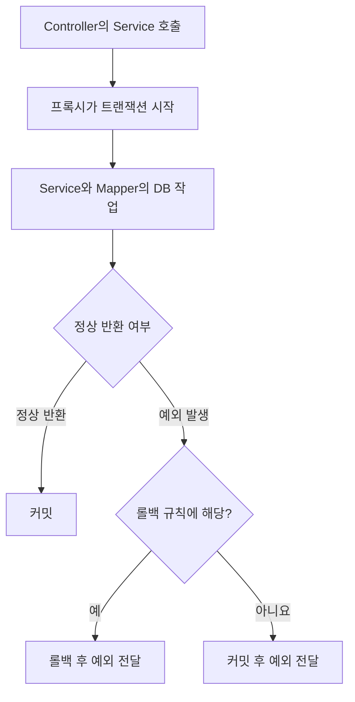
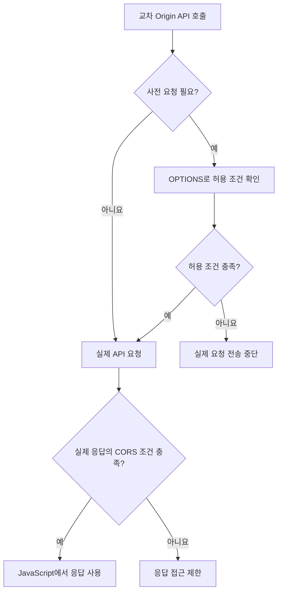

> 📅 **작성일** : 2026-09-03

# 📚 Today I Learned

오늘 학습한 내용을 기록하고 돌아본다.

---

## 🎯 Daily Quest

- [x] 알고리즘 1문제
	- [오늘 푼 문제](https://leetcode.com/problems/construct-uniform-parity-array-ii/?envType=daily-question&envId=2026-09-03)

**Language** : ☕ Java

---

# 🎯 오늘의 학습 목표

- DTO의 객체 생성 방식과 JSON 직렬화·역직렬화를 구분하고, Builder·생성자 애너테이션의 역할을 설명한다.
- 게시글·댓글의 1 조회 결과가 MyBatis를 거쳐 객체와 목록으로 매핑되는 과정을 설명한다.
- 프록시 기반 트랜잭션의 적용 경로와 커밋·롤백 범위를 구분한다.
- React의 API 요청부터 JSON 응답과 화면 갱신까지 연결하고, CORS 오류와 데이터 변환 오류를 구별한다.

---

# 📌 오늘의 핵심 요약

|주제|핵심 내용|
|---|---|
|DTO와 JSON|요청 JSON을 DTO로 만드는 과정은 역직렬화, 응답 DTO를 JSON으로 만드는 과정은 직렬화다.|
|Builder·생성자|객체를 만드는 방식이며, Jackson이 데이터를 읽고 쓰는 조건과 구분해야 한다.|
|MyBatis 1|`resultMap`과 `collection`으로 여러 조회 행을 부모 객체와 자식 목록에 매핑할 수 있다.|
|트랜잭션|함께 성공하거나 취소해야 하는 DB 작업을 묶고, 프록시가 설정에 따라 트랜잭션을 관리한다.|
|CORS|브라우저가 다른 Origin의 응답을 JavaScript에 공개할 수 있는지 서버의 허용 조건으로 판단한다.|
|React 연동|HTTP 상태 확인, JSON 파싱, 상태 갱신, 렌더링까지 이어져야 응답 데이터가 화면에 반영된다.|

---

# 🔄 오늘 학습 흐름

```text
게시글·댓글 화면에 필요한 데이터 구조 확인
    ↓
DTO 구성과 객체 생성, JSON 변환 방식 구분
    ↓
MyBatis로 게시글·댓글의 1:N 조회 결과 매핑
    ↓
Service에서 함께 처리할 DB 작업의 트랜잭션 경계 설정
    ↓
WebConfig로 React Origin의 API 접근 조건 설정
    ↓
React에서 API 호출 → 응답 해석 → 상태 갱신 → 화면 표시
```

---

# 📚 학습 내용

아래 코드는 개념을 연결하기 위한 **설명용 예제**다. API 경로·포트·테이블·필드명은 예시로 정했으며, Java 코드는 import와 일부 공통 설정을 생략했다. 각 public 클래스는 별도 파일로 작성하는 구조다.

## 1. DTO 구조와 객체 생성, JSON 변환을 구분하기

### 개념

React와 Spring Boot는 HTTP 요청·응답의 본문으로 JSON 데이터를 주고받을 수 있다. Java 객체가 그대로 브라우저에 전달되는 것은 아니므로, 서버 객체와 JSON 사이에 변환 과정이 필요하다.

|구분|입력|출력|발생 지점|
|---|---|---|---|
|서버의 역직렬화|요청 본문의 JSON|요청 DTO|`@RequestBody` 인자를 준비할 때|
|서버의 직렬화|응답 DTO|응답 본문의 JSON|Controller의 반환값을 응답 본문으로 쓸 때|
|브라우저의 JSON 파싱|응답 본문의 JSON|JavaScript 객체|`response.json()`을 호출할 때|

Spring MVC는 HTTP 메시지 변환기로 요청 본문을 읽고 응답 본문을 쓴다. Jackson을 사용하는 구성에서는 Jackson이 DTO와 JSON 사이의 변환을 담당한다. [Spring MVC 메시지 변환 공식 문서](https://docs.spring.io/spring-framework/reference/web/webmvc/message-converters.html)

### 게시글·댓글 응답 구조

게시글 하나와 그 게시글에 달린 댓글 목록을 반환하는 예시다.

```json
{
  "id": 1,
  "title": "React와 Spring Boot 연동",
  "comments": [
    { "id": 101, "content": "관계 매핑 정리" },
    { "id": 102, "content": "트랜잭션 복습" }
  ]
}
```

프론트에서는 `data.title`로 제목을 읽고, `data.comments`를 배열로 순회한다. 이 구조에 맞춰 서버에서는 게시글 DTO 안에 댓글 DTO 목록을 둔다.

### 핵심 코드

```java
// BlogResponse.java
@Getter
@Setter
@NoArgsConstructor
@AllArgsConstructor
@Builder
public class BlogResponse {
    private Long id;
    private String title;
    private List<CommentResponse> comments;
}

// CommentResponse.java
@Getter
@Setter
@NoArgsConstructor
public class CommentResponse {
    private Long id;
    private String content;
}
```

예제 DTO의 패키지는 `com.example.blog.dto`로 가정한다. 이후 MyBatis 매핑에서 이 타입을 사용한다.

### Builder와 생성자 애너테이션의 역할

|구성|역할|예제에서의 사용|
|---|---|---|
|`@NoArgsConstructor`|인자가 없는 생성자 생성|먼저 빈 객체를 만들고 값을 채우는 방식 지원|
|`@AllArgsConstructor`|생성 대상 인스턴스 필드를 받는 생성자 생성|`BlogResponse`의 id·title·comments를 한 번에 전달|
|`@Builder`|값을 지정한 뒤 `build()`로 객체를 만드는 코드 생성|생성 시 전달하는 값의 의미를 읽기 쉽게 표현|
|`@Getter`|값을 읽는 접근자 생성|응답 데이터를 읽어 JSON 속성으로 변환하는 데 사용 가능|
|`@Setter`|값을 쓰는 접근자 생성|예제의 속성 기반 매핑에서 값 설정에 사용|

생성자 애너테이션은 생성자를 만들 뿐, getter·setter까지 함께 만들지는 않는다. [Lombok 생성자 공식 문서](https://projectlombok.org/features/constructor)

```java
BlogResponse response = BlogResponse.builder()
    .id(1L)
    .title("React와 Spring Boot 연동")
    .comments(List.of())
    .build();
```

`builder()`로 값을 모으고 `build()`에서 DTO를 만든다. 클래스에 `@Builder`를 붙일 때는 빌더가 호출할 생성자도 맞아야 한다. 예제에서는 `@AllArgsConstructor`로 해당 생성자를 제공한다. 생성자를 직접 작성하는 경우에는 원하는 생성자에 `@Builder`를 붙이는 방식도 사용할 수 있다. [Lombok Builder 공식 문서](https://projectlombok.org/features/Builder)

### DTO 변환에서 헷갈리기 쉬운 점

- **응답 직렬화에서는 이미 만들어진 객체의 값을 읽는다.** 기본 생성자가 없다는 이유만으로 직렬화가 실패한다고 판단하면 안 된다.
- **요청 역직렬화에서는 객체 생성과 값 설정 방법이 필요하다.** 기본 생성자와 setter는 그중 한 가지 방식이다.
- Jackson이 사용할 생성자나 팩토리를 지정하는 방식도 있으므로, 모든 DTO에 기본 생성자가 반드시 필요한 것은 아니다.
- `@Builder`만 붙였다고 Jackson이 그 빌더를 자동으로 사용하는 것은 아니다. 모든 애너테이션을 일괄 추가하기보다 선택한 변환 방식에 맞춰 구성해야 한다. [Jackson 객체 생성·속성 매핑 공식 문서](https://github.com/FasterXML/jackson-databind#annotations-using-custom-constructor)

요청 DTO를 기본 생성자와 setter로 구성하는 예시는 다음과 같다.

```java
@Getter
@Setter
@NoArgsConstructor
public class CommentCreateRequest {
    private String content;
}
```

`@RequestBody CommentCreateRequest`는 JSON 본문을 이 객체로 변환해 받는다. 반면 `@RestController`에서 응답 DTO를 반환하면 응답 본문을 만드는 변환이 수행된다. [Spring의 RequestBody 설명](https://docs.spring.io/spring-framework/reference/web/webmvc/mvc-controller/ann-methods/requestbody.html), [Spring의 ResponseBody 설명](https://docs.spring.io/spring-framework/reference/web/webmvc/mvc-controller/ann-methods/responsebody.html)

### 핵심 포인트

> 객체를 만드는 방법과 객체를 JSON으로 읽고 쓰는 방법은 구분해야 한다. DTO 오류를 볼 때는 먼저 요청 역직렬화인지 응답 직렬화인지 확인한다.

---

## 2. MyBatis로 게시글·댓글의 1 관계 매핑하기

### 개념

앞에서 정한 DTO 구조에 데이터를 채우려면 DB의 조회 결과를 객체 구조로 변환해야 한다.

게시글 하나에 댓글 여러 개가 연결되는 관계가 1이다. JOIN 결과는 행 단위이므로, 같은 게시글 정보가 댓글 수만큼 반복될 수 있다.

|blog_id|blog_title|comment_id|comment_content|
|---|---|---|---|
|1|React와 Spring Boot 연동|101|관계 매핑 정리|
|1|React와 Spring Boot 연동|102|트랜잭션 복습|

이 두 행을 게시글 객체 하나와 댓글 객체 두 개가 담긴 목록으로 묶는 것이 관계 매핑이다.

### 핵심 코드

```java
@Mapper
public interface BlogMapper {
    BlogResponse findByIdWithComments(
        @Param("blogId") Long blogId
    );
}
```

다음은 Mapper XML의 핵심 부분이다.

```xml
<mapper namespace="com.example.blog.mapper.BlogMapper">
    <resultMap id="blogWithComments"
               type="com.example.blog.dto.BlogResponse">
        <id property="id" column="blog_id"/>
        <result property="title" column="blog_title"/>

        <collection property="comments"
                    ofType="com.example.blog.dto.CommentResponse"
                    notNullColumn="comment_id">
            <id property="id" column="comment_id"/>
            <result property="content" column="comment_content"/>
        </collection>
    </resultMap>

    <select id="findByIdWithComments" resultMap="blogWithComments">
        SELECT b.id AS blog_id,
               b.title AS blog_title,
               c.id AS comment_id,
               c.content AS comment_content
        FROM blog b
        LEFT JOIN comment c ON c.blog_id = b.id
        WHERE b.id = #{blogId}
        ORDER BY c.id
    </select>
</mapper>
```

`@Param("blogId")`와 SQL의 `#{blogId}`를 맞추고, SELECT의 별칭과 `resultMap`의 `column`을 맞춘다.

|매핑 요소|의미|
|---|---|
|`resultMap`|조회 컬럼을 객체의 어떤 속성에 담을지 정의|
|부모의 `id`|반복된 행에서 같은 게시글을 식별|
|`collection`|댓글처럼 여러 객체를 목록 속성에 매핑|
|`ofType`|목록에 들어갈 원소의 타입|
|자식의 `id`|댓글 객체의 식별 기준|
|`notNullColumn`|지정 컬럼에 값이 있을 때 자식 객체 생성|

`collection`은 JOIN 결과를 묶는 방식과 별도 SELECT로 자식 목록을 가져오는 방식 모두에 사용할 수 있다. 위 코드는 JOIN 결과를 사용하는 예시다. [MyBatis 관계 매핑 공식 문서](https://mybatis.org/mybatis-3/sqlmap-xml.html#collection)

### 동작 흐름

```text
게시글 ID로 Mapper 호출
    ↓
게시글과 댓글을 LEFT JOIN하여 조회
    ↓
blog_id로 같은 게시글 식별
    ↓
comment_id가 있는 행을 댓글 객체로 매핑
    ↓
BlogResponse의 comments 목록에 연결
```

### 주의점

- `LEFT JOIN`은 댓글이 없어도 게시글을 조회하기 위한 선택이다. 게시글 자체가 없는 경우와 댓글만 없는 경우를 구분한다.
- 중첩 매핑의 `id`는 객체 식별에 사용된다. DB에 PK 제약조건을 새로 만드는 설정은 아니다.
- 컬럼 이름의 자동 변환만으로 1 목록 구조까지 자동으로 완성되는 것은 아니다.
- `comments`를 빈 배열로 반환할지 등 응답 구조를 정하고, 프론트의 접근 방식도 그 구조에 맞춘다.

### 핵심 포인트

> SQL은 행을 조회하고, MyBatis는 그 행을 객체와 목록으로 묶는다. DTO를 JSON으로 바꾸는 작업은 이후 응답 변환 단계에서 이루어진다.

---

## 3. 프록시 기반 트랜잭션으로 논리적 작업 단위 묶기

### 필요한 이유

관계가 있는 데이터는 변경할 때도 함께 처리해야 할 수 있다. 예를 들어 게시글과 댓글을 함께 삭제해야 한다면, 댓글 삭제만 성공하고 게시글 삭제는 실패한 상태가 남지 않도록 작업 범위를 묶어야 한다.

이처럼 업무상 함께 성공하거나 취소되어야 하는 DB 작업의 묶음이 트랜잭션의 경계를 정하는 기준이다.

### 프록시와 @Transactional

프록시는 실제 Service 호출을 앞에서 받아 트랜잭션 처리를 적용하는 객체다. Spring의 기본 프록시 방식에서는 **Spring 빈의 프록시를 거친 호출**에 트랜잭션 동작이 적용된다. [Spring Transactional 공식 문서](https://docs.spring.io/spring-framework/reference/data-access/transaction/declarative/annotations.html)

아래는 기존 트랜잭션이 없고, Service 호출에서 새 트랜잭션을 시작하는 경우의 기본 흐름이다.



이미 롤백만 가능하도록 표시된 상태나 커밋 자체의 실패 등은 별도로 고려해야 한다. 위 흐름은 일반적인 반환·예외 처리의 차이를 보여준다.

### 핵심 코드

설명용으로 댓글 삭제와 게시글 삭제를 하나의 Service 메서드에 묶었다. 두 Mapper의 삭제 메서드는 각각 해당 DELETE SQL을 실행한다고 가정한다.

```java
@Service
public class BlogService {
    private final BlogMapper blogMapper;
    private final CommentMapper commentMapper;

    public BlogService(BlogMapper blogMapper,
                       CommentMapper commentMapper) {
        this.blogMapper = blogMapper;
        this.commentMapper = commentMapper;
    }

    @Transactional
    public void deleteBlog(Long blogId) {
        commentMapper.deleteByBlogId(blogId);

        int deleted = blogMapper.deleteById(blogId);
        if (deleted != 1) {
            throw new IllegalStateException("게시글 삭제 실패");
        }
    }
}
```

`IllegalStateException`이 프록시까지 전달되면 기본 롤백 규칙에 따라 앞서 수행한 댓글 삭제도 함께 롤백된다. 이를 위해서는 두 작업이 같은 트랜잭션에 참여해야 한다.

MyBatis-Spring은 Spring 트랜잭션에 참여하며, 일반적인 단일 DB 구성에서는 트랜잭션 관리자와 SqlSessionFactory가 같은 DataSource를 사용해야 한다. [MyBatis-Spring 트랜잭션 공식 문서](https://mybatis.org/spring/transactions.html)

### 커밋·롤백 판단

아래는 별도로 롤백 정책을 변경하지 않은 기본 설정 기준이다.

|메서드 처리 결과|기본 동작|
|---|---|
|정상 반환|커밋. 단, 이미 rollback-only 상태이면 정상 커밋되지 않음|
|`RuntimeException` 또는 `Error`가 밖으로 전달|롤백|
|checked exception이 밖으로 전달|기본적으로 해당 예외만으로는 롤백하지 않음|
|예외를 내부에서 잡고 정상 반환|프록시가 그 예외를 기준으로 자동 롤백할 수 없음. 이미 지정된 rollback-only 상태는 별개|

checked exception도 롤백해야 하는 업무라면 `rollbackFor` 등으로 규칙을 지정할 수 있다. 따라서 “예외가 발생하면 무조건 롤백된다”는 설명은 정확하지 않다. [Spring 롤백 규칙 공식 문서](https://docs.spring.io/spring-framework/reference/data-access/transaction/declarative/rolling-back.html)

### 같은 객체 내부 호출 주의

```java
public void outer() {
    this.inner();
}

@Transactional
public void inner() {
    // DB 작업
}
```

같은 객체 안에서 `this.inner()`를 호출하면 `inner()`에 대한 프록시 처리를 거치지 않는다. 그래서 이 애너테이션으로 트랜잭션이 새로 적용되지 않는다.

다만 `outer()`가 이미 트랜잭션 안에서 실행 중이라면 내부 DB 작업도 기존 트랜잭션에 참여할 수 있다. “내부 호출이면 언제나 트랜잭션이 없다”로 외우면 안 된다.

### 핵심 포인트

> 트랜잭션은 함께 처리할 DB 작업의 범위를 정하는 장치다. 애너테이션의 위치뿐 아니라 프록시를 거치는 호출 경로와 예외가 전달되는 방식까지 확인해야 한다.

---

## 4. WebConfig로 CORS 설정하기

### 개념

서버의 처리 흐름이 준비되었더라도 브라우저가 다른 Origin의 응답을 JavaScript에서 사용하려면 CORS 조건을 충족해야 한다.

Origin은 **프로토콜·호스트·포트의 조합**이다. 예시의 React 주소 `http://localhost:5173`과 Spring Boot 주소 `http://localhost:8080`은 포트가 달라 서로 다른 Origin이다.

CORS 허용 여부는 서버의 응답 헤더를 바탕으로 브라우저가 판단한다. 서버에 요청이 도착했다는 사실과 JavaScript가 응답을 읽을 수 있다는 사실은 구분해야 한다. [MDN CORS 설명](https://developer.mozilla.org/en-US/docs/Web/HTTP/Guides/CORS)

### 핵심 코드

아래는 예제 React Origin에서 `/api/**`에 GET·POST·DELETE 요청을 보내는 경우의 설정이다.

```java
@Configuration
public class WebConfig implements WebMvcConfigurer {
    @Override
    public void addCorsMappings(CorsRegistry registry) {
        registry.addMapping("/api/**")
            .allowedOrigins("http://localhost:5173")
            .allowedMethods("GET", "POST", "DELETE")
            .allowedHeaders("Content-Type");
    }
}
```

|설정|실제 요청과 대조할 대상|
|---|---|
|`addMapping`|백엔드 요청 경로|
|`allowedOrigins`|요청을 보내는 프론트 페이지의 Origin|
|`allowedMethods`|GET·POST 등 실제 API 요청 메서드|
|`allowedHeaders`|실제 요청에서 사용할 헤더|

`allowedOrigins`에는 허용할 **프론트 Origin**을 넣는다. Spring MVC는 설정을 바탕으로 사전 요청을 처리하므로, 보통 OPTIONS 전용 Controller를 직접 만들 필요는 없다. [Spring MVC CORS 공식 문서](https://docs.spring.io/spring-framework/reference/web/webmvc-cors.html)

### 사전 요청과 실제 요청

브라우저는 필요한 경우 실제 요청 전에 OPTIONS 사전 요청을 보낸다.

- GET·HEAD·POST이면서 허용 목록에 속하는 헤더·Content-Type 등의 조건을 충족하면 사전 요청 없이 진행할 수 있다.
- `Content-Type: application/json`을 사용하는 교차 Origin POST나 허용 목록 밖의 사용자 지정 헤더는 사전 요청이 필요한 대표적인 경우다.
- 사전 요청 허용 결과가 캐시되어 있다면 매번 새로운 OPTIONS가 보이지 않을 수 있다.



사전 요청을 통과해도 실제 응답이 CORS 조건을 충족해야 한다. OPTIONS의 상태 코드만 보지 말고 허용 Origin·메서드·헤더도 확인한다. [MDN 사전 요청 설명](https://developer.mozilla.org/en-US/docs/Web/HTTP/Guides/CORS#preflighted_requests)

### 핵심 포인트

> CORS를 확인할 때는 요청이 어느 단계까지 진행됐는지 먼저 구분한다. 실제 요청이 실행된 뒤 응답 접근만 제한된 경우도 있다.

---

## 5. React에서 게시글·댓글 API의 응답을 화면에 연결하기

### 개념

API 호출은 데이터를 가져오는 단계다. 화면에 표시하려면 응답을 JavaScript 객체로 해석하고, React 상태를 변경해야 한다.

예제에서 사용하는 API 계약은 다음과 같다.

|요청|요청 본문|성공 응답|
|---|---|---|
|`GET /api/blogs/1`|없음|`200`과 게시글·댓글 JSON 객체|
|`POST /api/blogs/1/comments`|`{"content":"댓글 내용"}`|`204 No Content`|

이 경로와 응답 형식은 설명을 위한 가정이다. 실제 연동에서는 강의 코드의 Controller와 응답 DTO를 기준으로 맞춘다.

### 동작 흐름

```text
사용자가 게시글 조회 실행
    ↓
React에서 GET 요청
    ↓
Controller → Service → Mapper → DB 조회
    ↓
MyBatis가 게시글·댓글 DTO 구성
    ↓
Controller의 응답 DTO를 JSON으로 변환
    ↓
브라우저가 CORS 조건 확인
    ↓
response.json()으로 JavaScript 객체 생성
    ↓
setBlog(data)로 상태 갱신 예약
    ↓
새 상태를 사용하는 렌더링에서 제목과 댓글 표시
```

### 핵심 코드: 게시글과 댓글 목록 조회

조회 버튼으로 고정된 예제 게시글을 가져오는 컴포넌트다.

```js
import { useState } from "react";

const BLOG_URL = "http://localhost:8080/api/blogs/1";

export default function BlogDetail() {
  const [blog, setBlog] = useState(null);
  const [error, setError] = useState("");
  const [loading, setLoading] = useState(false);

  async function loadBlog() {
    setLoading(true);
    setError("");

    try {
      const response = await fetch(BLOG_URL);

      if (!response.ok) {
        throw new Error("게시글 조회 실패: " + response.status);
      }

      const data = await response.json();
      setBlog(data);
    } catch (error) {
      setError(error.message);
    } finally {
      setLoading(false);
    }
  }

  return (
    <section>
      <button onClick={loadBlog} disabled={loading}>
        {loading ? "조회 중" : "게시글 조회"}
      </button>

      {error && <p role="alert">{error}</p>}

      {blog && (
        <>
          <h2>{blog.title}</h2>
          <ul>
            {blog.comments.map((comment) => (
              <li key={comment.id}>{comment.content}</li>
            ))}
          </ul>
        </>
      )}
    </section>
  );
}
```

이 예제는 응답의 `comments`가 배열이라는 계약을 사용한다. 실제 응답이 `{"data": {...}}`로 감싸져 있다면 `setBlog(data.data)`처럼 해당 구조에 맞춰야 한다.

`setBlog`는 다음 렌더링에 사용할 상태를 갱신한다. 호출 직후 같은 함수에서 `blog`를 읽는다고 새 값이 즉시 보장되는 것은 아니다. [React useState 공식 문서](https://react.dev/reference/react/useState)

### 핵심 코드: 댓글 JSON 전송

다음 함수는 댓글 등록 요청을 보내는 설명용 예시다. 컴포넌트의 댓글 등록 이벤트에서 호출하고, 성공 후 게시글·댓글을 다시 조회하면 서버의 결과를 화면에 반영할 수 있다.

```js
async function createComment(blogId, content) {
  const response = await fetch(
    "http://localhost:8080/api/blogs/" + blogId + "/comments",
    {
      method: "POST",
      headers: {
        "Content-Type": "application/json",
      },
      body: JSON.stringify({ content }),
    }
  );

  if (!response.ok) {
    throw new Error("댓글 등록 실패: " + response.status);
  }

  // 예제 계약은 204 응답이므로 response.json()을 호출하지 않는다.
}
```

`JSON.stringify`는 JavaScript 객체를 요청 본문에 넣을 JSON 문자열로 바꾼다. 서버는 `@RequestBody`와 메시지 변환기를 통해 이를 요청 DTO로 읽는다.

`fetch`는 404·500 같은 HTTP 오류 상태만으로 Promise를 거부하지 않으므로 `response.ok`를 확인해야 한다. JSON 응답을 받는 경우에는 `response.json()`도 별도로 기다려야 한다. [MDN Fetch 사용 설명](https://developer.mozilla.org/en-US/docs/Web/API/Fetch_API/Using_Fetch)

### 오류를 구분하는 기준

아래는 특정 오류를 실제 해결했다는 기록이 아니라, 연동 중 원인을 찾을 때 사용할 판단 기준이다.

|관찰한 현상|우선 확인할 지점|
|---|---|
|OPTIONS가 실패하고 실제 요청이 없음|사전 요청의 허용 조건과 서버 응답|
|실제 요청은 있지만 JavaScript에서 응답을 읽지 못함|실제 응답의 CORS 헤더와 브라우저 오류 메시지|
|서버 로그에서 요청 DTO 생성·값 설정 오류|역직렬화 방식, JSON 필드·타입, 생성자와 접근자|
|서버 로그에서 응답 본문을 만드는 중 오류|응답 DTO의 읽을 수 있는 속성과 직렬화 설정|
|JSON을 받았지만 속성이 undefined이거나 목록 표시 실패|응답의 중첩 구조·배열 여부와 프론트 접근 경로|

브라우저 메시지 하나로 원인을 확정하지 않고 Network의 요청·응답과 서버 로그의 `Caused by`를 함께 확인한다.

### 트랜잭션과 응답 실패의 경계

앞의 Service 메서드처럼 트랜잭션을 설정했다면, 프록시의 커밋 처리가 끝난 뒤 Controller의 응답 직렬화와 브라우저의 화면 처리가 이어질 수 있다.

**이 호출 순서에서 Service 트랜잭션이 이미 커밋되었다면, 이후 JSON 응답 변환이나 CORS 접근에 실패해도 그 실패만으로 DB 작업이 되돌아가지는 않는다.** 화면에서 실패로 보이는 것과 DB 변경의 실패는 구분해서 확인해야 한다.

### 핵심 포인트

> 프론트 연동은 요청 전송, 서버 처리, 응답 사용, React 상태 갱신으로 이어진다. 문제가 생기면 어느 단계까지 성공했는지 확인해야 원인을 좁힐 수 있다.

---

# 🧠 오늘 이해한 핵심

- **데이터 구조와 변환 역할의 연결:** MyBatis는 조회 행을 DTO로 매핑하고, Jackson은 DTO와 JSON을 변환하며, React는 해석한 데이터를 상태와 화면에 연결한다.
- **객체 생성과 JSON 변환의 구분:** Builder·생성자는 객체 생성 방식을 제공한다. 요청 역직렬화와 응답 직렬화는 각각 필요한 조건을 따로 확인해야 한다.
- **서버 작업과 화면 결과의 경계:** 트랜잭션은 설정된 DB 작업 범위를 관리한다. CORS와 응답 변환은 별도 단계이므로 화면 결과만으로 커밋·롤백 여부를 판단할 수 없다.

---

# 🔍 복습할 부분

- 게시글에 댓글이 여러 개 있는 경우와 없는 경우의 JOIN 결과를 비교하고, 부모·자식의 `id`와 `collection` 설정이 DTO 목록에 어떻게 연결되는지 설명하기.
- 외부에서 Service 프록시를 호출하는 경우와 같은 객체 내부에서 호출하는 경우를 비교하고, 기존 트랜잭션 유무와 예외 전달 방식에 따라 적용·롤백 여부 판단하기.
- `@Builder`·`@NoArgsConstructor`·`@AllArgsConstructor`가 제공하는 코드를 구분하고, 요청 DTO 생성 문제와 응답 DTO 직렬화 문제에서 무엇을 확인해야 하는지 정리하기.
- 댓글 등록 요청을 기준으로 사전 요청, 실제 응답, JSON 변환, React 상태 갱신을 추적하고, 응답 단계의 실패가 이미 커밋된 DB 작업에 어떤 의미인지 설명하기.

---

# 🔄 함께 복습한 내용

|복습 주제|핵심 정리|
|---|---|
|Swagger UI와 React 호출 비교|같은 API라도 페이지의 Origin과 요청 URL·헤더가 달라질 수 있다. Swagger UI가 API와 같은 Origin에서 실행된다면 React의 교차 Origin 호출과 조건이 다르므로, Swagger 성공만으로 프론트 연동 성공을 판단할 수 없다.|
|OPTIONS 실패와 실제 응답 접근 제한|사전 요청이 실패하면 브라우저는 실제 요청을 보내지 않는다. 실제 요청 이후 CORS 조건이 맞지 않으면 서버가 이미 처리했더라도 JavaScript의 응답 접근이 제한될 수 있다.|
|DTO부터 화면까지 추적|Controller의 DTO, 응답 JSON, 프론트의 접근 경로, 상태 갱신을 차례로 연결한다. 데이터를 읽었지만 속성 구조가 맞지 않는 문제와 CORS 때문에 응답을 읽지 못하는 문제를 구분한다.|
|CORS 설정 개선 확인|적용 경로·허용 Origin·메서드·요청 헤더를 실제 요청과 대조한다. 사전 요청이 있다면 그 응답을 먼저 보고, 실제 응답의 허용 헤더와 화면 반영까지 확인한다.|
