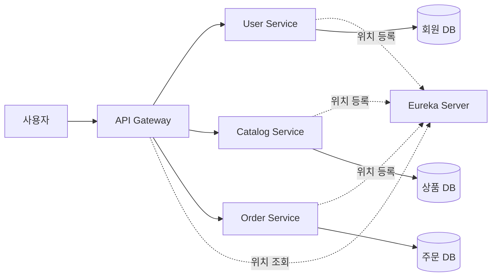

오늘은 쇼핑몰의 회원·상품·주문 기능을 각각 별도의 Spring Boot 애플리케이션으로 만들고, Eureka로 실행 위치를 찾고, API Gateway를 공통 입구로 두어 호출하는 구조를 학습했다. 이어서 각 서비스 안에서 요청이 Controller → Service → Repository를 거쳐 H2 데이터베이스에 저장되고, 응답 전용 객체로 돌아오는 과정을 회원가입·상품 목록·주문 생성으로 따라갔다.

> 서비스를 나누는 것, 위치를 찾는 것, 요청을 전달하는 것, 입력을 검증하는 것, DB에 저장하는 것, 권한을 확인하는 것은 모두 서로 다른 책임이다.

## 🎯 오늘의 학습 목표

- 회원·상품·주문을 별도 서비스로 나누는 이유와, Eureka·API Gateway가 각각 맡는 역할을 구분해 설명할 수 있다.
- `server.port: 0`, 서비스 이름, Gateway의 `Path` 조건이 실제 호출 경로와 포트에 어떤 영향을 주는지 설명할 수 있다.
- 회원가입 요청이 검증 → DTO 변환 → UUID 생성 → BCrypt 해싱 → 저장 → `201 Created` 응답으로 이어지는 흐름을 코드와 연결할 수 있다.
- 주문 생성·조회 API가 하는 일과, 회원 상세의 주문 목록·재고 차감처럼 아직 연결되지 않은 부분을 구분할 수 있다.

## 📌 오늘의 핵심 요약

| 주제 | 핵심 내용 |
| --- | --- |
| 서비스 분리 | 업무 책임·실행 단위·데이터 소유권을 나누는 대신, 서비스 사이의 연결을 관리해야 한다. |
| Eureka와 Gateway | Eureka는 실행 위치를 알려주고, Gateway는 경로를 보고 실제 요청을 알맞은 서비스로 전달한다. |
| H2와 JPA | Entity와 Repository로 자바 객체를 테이블의 행으로 저장하며, 관리 화면 주소와 DB 연결 주소는 다르다. |
| 회원가입 | 입력·내부 처리·저장·출력 객체를 나눠 검증하고 저장한 뒤, 비밀번호 없는 응답을 `201`로 돌려준다. |
| Security와 BCrypt | 인증·인가는 접근 규칙이고, BCrypt는 복호화할 수 없는 비밀번호 해싱이며 `matches`로 검증한다. |
| 상품·주문 서비스 | 상품 목록 조회와 주문 저장·조회는 구현됐지만, 서비스 간 주문 조회와 재고 차감은 아직 연결되지 않았다. |

## 🔄 오늘 학습 흐름

```text
쇼핑몰 기능을 회원·상품·주문 서비스로 분리
    ↓ 나뉜 서비스의 위치를 찾고 하나의 입구가 필요함
Eureka 등록과 Gateway 라우트로 서비스 호출
    ↓ 각 서비스가 자신의 데이터를 보관해야 함
H2와 JPA로 Entity를 테이블에 저장
    ↓ 첫 업무 기능으로 회원을 만듦
회원가입 요청의 검증·저장·응답과 회원 조회
    ↓ 저장할 비밀번호와 API 접근을 보호해야 함
Spring Security와 BCrypt 비밀번호 해싱
    ↓ 같은 구조를 상품과 주문으로 확장함
상품 목록·주문 생성과 아직 연결되지 않은 부분
```

**본문 찾아보기**

1. [쇼핑몰을 회원·상품·주문 서비스로 나누는 이유](#1-쇼핑몰을-회원상품주문-서비스로-나누는-이유)
2. [서비스를 Eureka에 등록하고 Gateway로 호출하기](#2-서비스를-eureka에-등록하고-gateway로-호출하기)
3. [H2와 JPA로 자바 객체를 데이터베이스에 저장하기](#3-h2와-jpa로-자바-객체를-데이터베이스에-저장하기)
4. [회원 서비스에서 가입 요청을 검증·저장·응답하기](#4-회원-서비스에서-가입-요청을-검증저장응답하기)
5. [Spring Security와 BCrypt로 비밀번호 다루기](#5-spring-security와-bcrypt로-비밀번호-다루기)
6. [상품·주문 서비스와 아직 연결되지 않은 부분](#6-상품주문-서비스와-아직-연결되지-않은-부분)

## 📚 학습 내용

### 1. 쇼핑몰을 회원·상품·주문 서비스로 나누는 이유

오늘 만든 쇼핑몰은 하나의 큰 프로그램이 아니라 회원, 상품, 주문을 맡는 세 개의 프로그램이 함께 움직이는 구조다. 코드를 짜기 전에 왜 나누는지, 나누면 어떤 문제가 새로 생기는지를 먼저 이해해야 뒤에 나오는 Eureka와 Gateway가 왜 필요한지 보인다.

#### 1.1 마이크로서비스를 쇼핑몰 담당자로 이해하기

**마이크로서비스**는 하나의 프로그램에 모든 기능을 넣는 대신, 업무 책임에 따라 나눈 여러 프로그램을 함께 운영하는 구조다. 기준은 "코드 파일이 몇 개냐"가 아니라 **업무 책임과 실행 단위**다. `UserController`와 `OrderController`를 다른 파일로 만드는 것만으로는 마이크로서비스가 되지 않는다. 서로 다른 애플리케이션으로 따로 실행돼야 한다.

비전공자도 이해할 수 있게 쇼핑몰 담당자에 비유하면 다음과 같다.

| 구성 | 쇼핑몰 비유 | 실제 역할 |
| --- | --- | --- |
| User Service | 고객 명부 담당자 | 회원가입, 회원 목록·상세 등 사용자 정보 관리 |
| Catalog Service | 상품 진열·재고 담당자 | 판매할 상품 목록과 가격·재고 정보 관리 |
| Order Service | 주문 장부 담당자 | 누가 어떤 상품을 몇 개 주문했는지 기록·조회 |
| Eureka | 담당자 자리 안내판 | 각 서비스가 지금 어디서 실행 중인지 알려줌 |
| API Gateway | 접수 창구 | 고객 요청을 알맞은 담당자에게 전달 |
| DB | 담당자별 기록 보관함 | 각 서비스가 자기 데이터를 저장 |

**서비스별로 다루는 주요 정보**

| 서비스 | 주요 정보 |
| --- | --- |
| User Service | `email`, `name`, `userId`, 비밀번호 해시 |
| Catalog Service | `productId`, `productName`, `stock`, `unitPrice`, `createdAt` |
| Order Service | `userId`, `orderId`, `productId`, `qty`, `unitPrice`, `totalPrice`, `createdAt` |

#### 1.2 서비스마다 DB를 따로 둔다는 의미

회원 DB의 주인은 회원 서비스이고, 주문 DB의 주인은 주문 서비스다. 다른 서비스의 테이블을 직접 읽지 않고, 그 서비스를 통해 정보를 주고받도록 책임을 나누는 것이 이 설계의 방향이다.

"DB를 따로 둔다"는 말이 반드시 컴퓨터를 따로 쓴다는 뜻은 아니다. 핵심은 **데이터의 소유권과 접근 책임**을 나누는 것이다.

> [!NOTE]
> 실습에서 여러 서비스가 똑같이 `jdbc:h2:mem:testdb`를 써도, 서비스가 각각 다른 프로그램(JVM)으로 실행되면 이름만 같은 별개의 메모리 DB가 된다. 회원 서비스의 `testdb`와 주문 서비스의 `testdb`는 서로 공유되지 않는다.

#### 1.3 나누면 좋아지는 점과 새로 생기는 어려움

| 항목 | 성격 | 내용 |
| --- | --- | --- |
| 변경 범위 | 좋아지는 점 | 주문 기능만 고치고 주문 서비스만 다시 배포할 수 있다. |
| 확장 | 좋아지는 점 | 요청이 몰리는 서비스만 실행 개수(인스턴스)를 늘릴 수 있다. |
| 책임 | 좋아지는 점 | 업무와 데이터 관리 범위가 명확해진다. |
| 통신 | 새로 생기는 어려움 | 다른 서비스의 정보가 필요하면 네트워크로 요청해야 한다. |
| 위치 찾기 | 새로 생기는 어려움 | 주소와 포트가 바뀌는 서비스의 현재 위치를 찾아야 한다. |
| 함께 성공해야 하는 작업 | 새로 생기는 어려움 | 주문 저장과 재고 변경처럼 함께 성공해야 하는 일을 따로 설계해야 한다. |
| 운영 | 새로 생기는 어려움 | 실행·설정·로그·장애를 확인할 대상이 많아진다. |

Eureka와 API Gateway는 이 중 "위치 찾기"와 "하나의 입구"를 해결하는 구성요소다.

#### 1.4 전체 시스템 구성과 Inner·Outer Architecture

**Inner Architecture**는 서비스 내부의 업무 처리 구조다. 회원가입 처리, 주문 금액 계산, Controller–Service–Repository 분리가 여기에 속한다. **Outer Architecture**는 여러 서비스를 연결하고 운영하는 바깥 구조로, Eureka, API Gateway, Config Server, Message Broker가 여기에 속한다. 비유하면 Inner는 담당자 각자의 일 처리 방식이고, Outer는 담당자들을 연결하는 조직의 시설이다.



| 구성요소 | 역할 | 오늘의 구현 범위 |
| --- | --- | --- |
| Git Repository | 소스 코드와 설정을 버전으로 관리한다. | 전체 구성으로 등장 |
| Config Server | 여러 서비스의 설정을 한곳에서 제공한다. | 상세 구현 대상 아님 |
| Eureka Server | 서비스가 등록한 실행 위치를 보관하고 이름으로 찾게 한다. | 등록·조회에 사용 |
| API Gateway | 요청 경로를 보고 대상 서비스를 골라 요청을 전달한다. | 서비스별 라우트 추가 |
| Microservices | 실제 회원·상품·주문 기능을 처리한다. | 세 서비스 구현 |
| Message Broker | 서비스 사이에서 메시지를 발행하고 구독하게 돕는다. | 구조 이해 수준 |

#### 1.5 상품 목록 요청 한 건을 따라가기

사용자가 Gateway에 `GET /catalog-service/catalogs`를 보냈을 때의 흐름이다.

```text
사용자가 Gateway에 GET /catalog-service/catalogs 요청
    ↓ Path=/catalog-service/** 조건에 맞는 라우트 선택
lb://CATALOG-SERVICE로 실행 중인 상품 서비스 인스턴스 찾기
    ↓ 요청 전달
CatalogController가 요청을 받음
    ↓ 업무 처리 위임
CatalogService가 CatalogRepository에 전체 상품 조회 요청
    ↓ DB 조회
Repository가 상품 DB에서 데이터를 가져옴
    ↓ 응답 형태로 변환
Controller가 응답 객체 목록을 만듦
    ↓ Gateway를 거쳐 반환
사용자가 JSON 응답을 받음
```

여기서 Eureka는 요청을 중계하지 않는다. Eureka는 "상품 서비스가 지금 어느 주소에 있는지"라는 **위치 정보만 제공**하고, 실제 상품 조회 요청은 Gateway와 Catalog Service 사이에서 오간다.

#### 1.6 인스턴스와 부하 분산

같은 `user-service`를 두 번 실행하면 같은 일을 하는 **인스턴스**가 두 개 생긴다. 서비스 이름은 같아도 포트와 인스턴스 ID는 다르다. Gateway는 등록된 인스턴스들에 요청을 나눠 보낼 수 있다.

> [!WARNING]
> 요청을 여러 인스턴스로 나눠 보낸다고 DB까지 공유되거나 데이터가 복제되는 것은 아니다. 인스턴스마다 메모리 DB를 쓰면 저장된 데이터도 인스턴스별로 나뉜다.

#### 1.7 전체 설계와 오늘 구현한 범위 구분하기

전체 설계 그림에는 로그인, 회원 수정·삭제, 주문 후 재고 갱신, 서비스 간 메시지, Config Server, CI/CD, 컨테이너와 클러스터까지 등장한다. 하지만 오늘 다룬 코드가 이 모든 기능을 완성하는 것은 아니다.

| 구분 | 오늘 다룬 것 |
| --- | --- |
| 실제로 구현한 것 | 서비스 생성과 Eureka 등록, 상태 확인, H2·JPA 연결, 회원가입·목록·상세, Security와 BCrypt 해싱, 상품 초기 데이터와 목록, 주문 생성과 사용자별 조회, Gateway 라우트 |
| 자리만 만든 것 | 회원 상세 응답의 `orders` 목록(현재는 빈 목록) |
| 설계에만 있는 것 | 주문 후 재고 차감, 서비스 간 메시지, 가입 회원 로그인, Config Server, 배포·운영 환경 |

**전체 운영 환경에 등장한 용어**

| 용어 | 뜻 |
| --- | --- |
| CI/CD | 코드 변경을 빌드·검증하고 배포하는 작업을 자동화하는 흐름 |
| Container Runtime | 컨테이너를 실행하는 기반 |
| Container Registry | 컨테이너 이미지를 보관하는 저장소 |
| Cluster | 여러 실행 노드를 하나의 운영 단위로 묶은 환경 |
| Orchestration | 컨테이너 배치·실행·복구 등을 관리하는 일 |
| Ingress Controller | 클러스터 외부의 HTTP 요청을 내부로 연결하는 구성요소 |
| Monitoring | 서비스의 상태·오류·자원 사용을 관찰하는 일 |

> 전체 설계는 "최종적으로 연결할 모습"이고, 오늘 구현은 "그 연결의 바탕이 되는 개별 서비스와 API"다.

### 2. 서비스를 Eureka에 등록하고 Gateway로 호출하기

서비스를 나누면 "각 서비스가 지금 어디서 실행 중인가"와 "사용자는 어느 주소로 요청해야 하는가"라는 문제가 생긴다. 이 장에서는 서비스가 Eureka에 자신을 등록하는 설정, 실행할 때마다 바뀌는 포트, Gateway가 경로를 보고 서비스를 고르는 방식을 정리한다.

#### 2.1 서비스를 만들 때 넣는 의존성

| 의존성 | 하는 일 |
| --- | --- |
| Spring Web | HTTP 요청을 받는 Controller와 JSON 입출력을 제공한다. |
| Eureka Discovery Client | 서비스를 Eureka에 등록하고 등록 정보를 조회한다. |
| Spring Data JPA | Repository를 통해 자바 객체 중심으로 DB를 다루게 한다. |
| H2 Database | 설치 없이 쓰는 실습용 관계형 데이터베이스다. |
| Validation | 이메일 형식, 필수값, 길이 등 입력 조건을 검사한다. |
| Spring Security | 인증, 접근 제어, 비밀번호 인코더 등 보안 기능을 제공한다. |
| Lombok | getter·setter·생성자 같은 반복 코드를 줄인다. 컴파일 때 코드를 만들어 주므로 애노테이션 처리 설정이 중요하다. |
| ModelMapper | `RequestUser`를 `UserDto`로 바꾸는 식의 객체 간 필드 복사를 돕는다. |
| DevTools | 개발 중 변경 반영 등 편의 기능을 제공한다. |

#### 2.2 시작 클래스와 Eureka 등록 설정

아래는 강의 코드를 재구성한 예시다. `@SpringBootApplication`은 설정과 컴포넌트 탐색을 시작하는 기준이고, `@EnableDiscoveryClient`는 이 애플리케이션이 서비스 디스커버리 클라이언트임을 표시한다.

```java title="UserServiceApplication.java"
@SpringBootApplication
@EnableDiscoveryClient
public class UserServiceApplication {
    public static void main(String[] args) {
        SpringApplication.run(UserServiceApplication.class, args);
    }
}
```

디스커버리 클라이언트가 어떤 방식으로 활성화되는지는 사용 중인 Spring Cloud 버전과 구성에 영향을 받는다. 강의 코드는 애노테이션으로 명시하는 방식을 사용했다.

서비스 공통 설정 예시다. YAML은 들여쓰기로 설정의 소속을 나타내므로, `server` 아래의 `port`와 `spring` 아래의 `application`은 서로 다른 설정이다. 탭 대신 공백을 쓰고 같은 부모 아래 항목은 깊이를 맞춘다. 강조한 세 줄(포트, 서비스 이름, 인스턴스 ID)이 아래 표에서 설명하는 핵심 설정이다.

```yaml title="application.yml" {2,6,10}
server:
  port: 0

spring:
  application:
    name: user-service

eureka:
  instance:
    instance-id: ${spring.application.name}:${spring.application.instance_id:${random.value}}
  client:
    register-with-eureka: true
    fetch-registry: true
    service-url:
      defaultZone: http://localhost:8761/eureka
```

| 설정 | 의미 |
| --- | --- |
| `server.port: 0` | 실행할 때 비어 있는 포트를 자동으로 배정받는다. |
| `spring.application.name` | 서비스의 논리적 이름이다. `user-service`, `catalog-service`, `order-service`를 구분한다. |
| `instance-id` | 같은 이름의 서비스가 여러 개 실행돼도 인스턴스 하나하나를 구별하는 ID다. 예시는 서비스 이름과 랜덤 값을 조합한다. |
| `register-with-eureka: true` | 자신의 실행 정보를 Eureka에 등록한다. |
| `fetch-registry: true` | Eureka에 등록된 서비스 정보를 가져온다. |
| `defaultZone` | Eureka 서버의 접속 주소다. `defaultzone`처럼 임의로 바꾸지 않고 정해진 키 이름을 쓴다. |

#### 2.3 설정한 포트와 실제 실행 포트 구분하기

`server.port: 0`은 0번 포트로 접속한다는 뜻이 아니다. 서버가 시작할 때 사용 가능한 포트를 자동으로 배정해 달라는 요청이다. 그래서 설정값은 0이어도 실제 실행 포트는 `54825` 같은 값이 된다.

| 확인 대상 | 알 수 있는 값 |
| --- | --- |
| `server.port` | 설정한 값. 이 예제에서는 0이다. |
| `local.server.port` | 서버가 시작된 뒤에 확정되는 실제 실행 포트 정보다. |
| `request.getServerPort()` | 지금 요청을 처리하는 서버 쪽 포트다. 상태 확인 API에서 실제 포트를 보여줄 때 사용했다. |

> [!WARNING]
> 실제 포트는 웹 서버가 시작되기 전에는 정해지지 않는다. 빈(Bean)을 처음 만드는 시점에 `@Value("${local.server.port}")`로 주입하려 하면 값이 아직 없어 실패할 수 있다. 또 `${...}` 없이 `@Value("local.server.port")`라고 쓰면 설정을 읽지 않고 그 글자 자체가 들어간다.

#### 2.4 상태 확인 API와 환영 메시지 읽기

상태 확인 API는 서비스가 요청을 받고 응답할 수 있는지 확인하는 용도다. 간단한 문자열 응답이 DB나 다른 외부 시스템까지 정상이라는 보장은 아니다.

환영 메시지는 설정 파일에 두고 코드에서 읽는다.

```yaml
greeting:
  message: Welcome to the Simple E-commerce.
```

| 읽는 방법 | 방식 |
| --- | --- |
| `env.getProperty("greeting.message")` | `Environment`에 설정 이름을 지정해 꺼내 읽는다. |
| `@Value("${greeting.message}")` | 값을 필드나 생성자 매개변수에 주입받는다. |

이 예제에서는 두 방법 모두 설정된 환영 문구를 반환하는 데 사용한다.

#### 2.5 REST API는 HTTP 메서드와 경로를 함께 읽는다

`GET /users`는 사용자 목록 조회이고, `POST /users`는 사용자 생성이다. 경로가 같아도 메서드가 다르면 다른 기능이다. **JSON**은 데이터를 표현하는 형식이고 **HTTP**는 요청과 응답을 주고받는 통신 규칙이므로, "HTTP 요청의 본문에 JSON을 담아 보낸다"고 이해하면 된다.

**오늘 다룬 주요 API**

| 기능 | 메서드 | 경로 |
| --- | --- | --- |
| 회원가입 | POST | `/user-service/users` |
| 전체 회원 조회 | GET | `/user-service/users` |
| 회원 상세 조회 | GET | `/user-service/users/{userId}` |
| 상품 목록 조회 | GET | `/catalog-service/catalogs` |
| 사용자별 주문 생성 | POST | `/order-service/{userId}/orders` |
| 사용자별 주문 조회 | GET | `/order-service/{userId}/orders` |

`{userId}`는 그대로 입력하는 글자가 아니라 실제 회원 ID로 바꾸는 자리다. 예를 들어 `/order-service/abc-123/orders`처럼 쓴다.

**자료에 섞여 있는 경로 표기**

자료의 개요 표에는 `/order-service/users/{user_id}/orders`가 등장하지만, 주문 API 표와 Controller 실습은 `/order-service/{userId}/orders` 형태로 진행된다. 상태 확인 경로도 `/health-check`, `/health_check`, `/users/health_check`가 섞여 등장한다. 하이픈과 밑줄은 자동으로 같은 경로가 되지 않으므로, 실제 요청은 현재 Controller 매핑과 Gateway 설정을 기준으로 맞춘다.

#### 2.6 Gateway 라우트가 요청을 서비스로 보내는 방식

강의에서 사용한 형태의 Gateway 설정 예시다.

```yaml {5-8}
spring:
  cloud:
    gateway:
      routes:
        - id: user-service
          uri: lb://USER-SERVICE
          predicates:
            - Path=/user-service/**
        - id: catalog-service
          uri: lb://CATALOG-SERVICE
          predicates:
            - Path=/catalog-service/**
        - id: order-service
          uri: lb://ORDER-SERVICE
          predicates:
            - Path=/order-service/**
```

강조한 네 줄이 라우트 하나의 구성이다. 같은 구조가 상품과 주문 서비스에도 반복된다.

| 항목 | 의미 |
| --- | --- |
| `id` | 라우트 설정 자체를 구별하는 이름이다. |
| `uri` | 요청을 보낼 대상이다. `lb://`는 서비스 이름으로 실행 인스턴스를 골라 보내는 형태이며, 디스커버리와 로드밸런서 구성이 갖춰져 있어야 한다. |
| `predicates`의 `Path` | 이 라우트를 고를 요청 경로 조건이다. `/user-service/**`는 그 접두사 아래의 모든 경로를 뜻한다. |

#### 2.7 Path 조건은 경로를 잘라주지 않는다

Gateway에 `/user-service/health_check`로 요청했는데 서비스 Controller는 `/health_check`만 받는다면 404가 난다. `Path` 조건은 **어느 라우트를 고를지 정하는 조건일 뿐**이고, 별도의 경로 변경 필터가 없으면 Gateway는 `/user-service/health_check`를 그대로 전달하기 때문이다.

강의에서 보여준 해결 방향은 서비스가 받는 경로도 `/user-service/health_check`로 맞추는 것이다. 아래는 그 구성을 재구성한 예시다.

```java title="UserController.java" {2,4}
@RestController
@RequestMapping("/user-service")
public class UserController {
    @GetMapping("/health_check")
    public String status(HttpServletRequest request) {
        return "It's Working in User Service on Port " + request.getServerPort();
    }
}
```

클래스에 붙은 `@RequestMapping("/user-service")`와 메서드에 붙은 `@GetMapping("/health_check")`가 합쳐져 최종 경로가 `/user-service/health_check`가 된다. 응답에는 `request.getServerPort()`로 읽은 실제 실행 포트가 들어간다.

다른 해결 방법도 있다. 서비스는 `/health_check`를 유지하고, Gateway에서 `StripPrefix=1` 같은 필터로 첫 번째 경로 조각을 지우는 설계다.

> [!WARNING]
> 접두사를 유지하는 Controller와 접두사를 지우는 필터를 함께 적용하면 다시 경로가 어긋난다. 두 방법 중 하나만 고른다.

#### 2.8 직접 호출과 Gateway 호출 비교하기

서비스가 `/user-service` 접두사를 포함하는 현재 구성이라면 두 호출의 경로는 같고 포트만 다르다.

| 호출 방법 | 주소 |
| --- | --- |
| 직접 호출 | `http://localhost:실제회원포트/user-service/users` |
| Gateway 호출 | `http://localhost:8000/user-service/users` |

Gateway 호출은 중간에서 라우트를 고르고 서비스로 요청을 전달한다. 그래서 서비스 포트가 실행할 때마다 바뀌어도 사용자는 Gateway 주소 하나만 쓰면 된다.

#### 2.9 호출이 실패할 때 구간별로 확인하기

| 증상 | 확인할 것 |
| --- | --- |
| 직접 호출은 되는데 Gateway로만 404 | 요청이 `Path` 조건에 맞는지, Gateway가 전달하는 경로와 Controller의 클래스·메서드 매핑을 합친 경로가 같은지, `health-check`와 `health_check`를 혼동했는지, 접두사 제거 필터가 있는지 비교한다. |
| Eureka에는 UP인데 API가 안 됨 | 등록된 주소와 포트로 상태 API → 업무 API를 직접 호출하고, 다음으로 Gateway를 거쳐 호출한 뒤 실패한 서비스의 로그와 응답 상태를 본다. |
| 포트가 0으로 출력됨 | 설정값을 읽었기 때문이다. 실제 포트는 서버 시작 로그, Eureka 인스턴스 정보, `request.getServerPort()`로 확인한다. |
| `local.server.port`를 찾을 수 없음 | 서버 시작 전에 주입하려 했는지, `${...}` 문법을 썼는지, Spring의 `@Value` 대신 Lombok의 `@Value`를 import했는지 확인한다. |

설정값 주입용 `@Value`는 `org.springframework.beans.factory.annotation.Value`이고, Lombok의 `@Value`는 불변 클래스 코드를 만들어 주는 전혀 다른 애노테이션이다.

Eureka의 UP은 "인스턴스가 등록됐다"는 정보일 뿐, 모든 Controller 경로가 존재하거나 DB 조회가 성공한다는 뜻이 아니다. 404만 보고 Gateway 문제라고 단정하지 말고, 외부 요청 경로 → Gateway가 전달한 경로 → Controller 최종 매핑을 차례로 비교한다.

> 서비스는 이름으로 등록되고, Gateway는 경로로 서비스를 고른다. 외부 경로, Gateway가 전달한 경로, Controller 매핑이 모두 맞아야 요청이 도착한다.

### 3. H2와 JPA로 자바 객체를 데이터베이스에 저장하기

서비스가 요청을 받을 수 있게 됐다면, 이제 각 서비스가 자기 데이터를 보관해야 한다. 이 장에서는 실습용 DB인 H2에 접속하는 방법과, SQL을 직접 쓰지 않고 자바 객체를 테이블에 저장하게 해주는 JPA의 구성 요소를 정리한다.

#### 3.1 H2의 세 가지 사용 방식

**H2**는 자바로 작성된 관계형 DB다. 큰 DB를 따로 설치하지 않고도 데이터를 저장하고 SQL로 확인할 수 있어 실습에 쓴다.

| 방식 | 주소 예 | 특징 |
| --- | --- | --- |
| 메모리 DB | `jdbc:h2:mem:testdb` | 데이터가 메모리에만 있어 프로그램이 끝나면 영구 보관을 기대할 수 없다. |
| 파일 DB | `jdbc:h2:~/test` | 파일에 저장한다. `~`는 DB를 실행하는 프로세스 환경의 홈 경로이며, 브라우저로 접속한 사람의 PC 경로가 아니다. |
| 서버 방식 | TCP 등으로 연결 | DB 서버에 따로 접속하는 방식이다. 브라우저에서 H2 Console 화면을 여는 것과는 다르다. |

#### 3.2 H2 Console 주소와 JDBC URL은 다르다

| 주소 | 예 | 용도 |
| --- | --- | --- |
| H2 Console 주소 | `http://localhost:실제서비스포트/h2-console` | 브라우저에서 여는 DB 관리 화면의 주소 |
| JDBC URL | `jdbc:h2:mem:testdb` | 관리 화면이나 애플리케이션이 실제로 연결할 DB를 고르는 주소 |

그래서 `http://192.168.0.8:54825/order-service`는 주문 서비스의 HTTP 경로일 뿐 DB 접속 주소가 아니다. Console 경로가 `/h2-console`이라면 먼저 `http://192.168.0.8:54825/h2-console`로 들어간다. Controller의 `@RequestMapping` 접두사는 Console 경로를 바꾸지 않으며, `server.servlet.context-path`를 따로 지정했을 때만 그 경로를 앞에 붙인다.

#### 3.3 학습용 H2 설정 읽기

```yaml title="application.yml" {8}
spring:
  h2:
    console:
      enabled: true
      path: /h2-console
  datasource:
    driver-class-name: org.h2.Driver
    url: jdbc:h2:mem:testdb;DB_CLOSE_DELAY=-1
    username: sa
    password: ""
  jpa:
    hibernate:
      ddl-auto: update
```

| 설정 | 의미 |
| --- | --- |
| `console.enabled` | H2 관리 화면을 켠다. |
| `console.path` | 관리 화면에 접근할 HTTP 경로다. |
| `datasource` | 애플리케이션이 어떤 DB에 어떤 계정으로 연결할지 정한다. |
| `DB_CLOSE_DELAY=-1` | 마지막 연결이 닫혀도 메모리 DB를 바로 지우지 않는다. 프로그램을 종료한 뒤까지 데이터를 보관하는 옵션은 아니다. |

강조한 줄의 `DB_CLOSE_DELAY=-1`은 "연결이 잠깐 끊겨도 DB를 유지"하는 옵션이지 "영구 저장" 옵션이 아니라는 점이 핵심이다.

> [!WARNING]
> 자료의 `web-allow-others: true`는 다른 호스트에서도 Console에 접근하게 허용하는 설정이다. 강의의 원격 실습 맥락에서 쓴 것이며, Console을 외부에 공개하는 일반 운영 설정으로 받아들이지 않는다.

#### 3.4 H2 로그인 계정과 Security 계정 구분하기

H2 Console에서 입력하는 JDBC URL, 사용자 이름, 비밀번호는 애플리케이션의 `datasource` 설정과 맞춘다. `sa`는 이 실습의 예시 계정일 뿐 언제나 고정된 계정은 아니다.

| 계정 | 무엇을 인증하나 |
| --- | --- |
| Spring Security의 기본 사용자 `user` | HTTP 요청에 대한 인증 |
| H2의 `sa` | DB 연결에 대한 인증 |

#### 3.5 JPA, Hibernate, JDBC, Spring Data JPA의 관계

| 기술 | 역할 |
| --- | --- |
| JPA | 자바 객체와 관계형 DB를 연결하는 영속성 표준 |
| Hibernate | JPA를 구현한 대표 라이브러리 |
| JDBC | 자바에서 DB에 연결하고 SQL을 실행하는 기본 기술 |
| Spring Data JPA | JPA를 쓸 때 Repository 작성과 반복 작업을 줄여주는 도구 |

```text
Repository에 save 요청
    ↓ 표준 규칙에 따라 저장 처리
JPA·Hibernate가 객체를 SQL로 바꿈
    ↓ DB 연결
JDBC로 DB에 SQL 실행
```

"SQL을 직접 쓰지 않았다"와 "SQL이 실행되지 않았다"는 다른 말이다. JPA를 써도 DB에서는 SQL이 실행된다.

#### 3.6 Entity로 테이블 한 행을 표현하기

**Entity**는 DB 테이블에 대응하는 자바 객체다. 회원 한 명을 `UserEntity` 객체로 표현하고, `users` 테이블의 한 행으로 저장한다.

| 애노테이션 | 역할 |
| --- | --- |
| `@Entity` | JPA가 관리할 엔티티임을 지정한다. |
| `@Table(name="users")` | 테이블 이름을 지정한다. |
| `@Id` | 기본키를 지정한다. |
| `@GeneratedValue` | 기본키 생성 방식을 지정한다. |
| `@Column(nullable=false)` | DB에서 NULL을 허용하지 않는다. |
| `@Column(unique=true)` | DB에서 중복 값을 허용하지 않는다. |
| `@Column(length=50)` | 문자열 컬럼 길이를 정한다. |

요청 검증과 DB 제약은 같은 기능이 아니다. 요청 검증은 저장하기 전에 잘못된 입력을 걸러내고, DB 제약은 최종 저장된 데이터의 규칙을 지킨다. 그래서 `@NotNull`(검증 규칙)과 `@Column(nullable=false)`(DB 제약)는 적용 위치와 실패 시점이 다르다.

#### 3.7 Repository로 저장·조회하기

**Repository**는 DB 저장·조회를 맡는 인터페이스다.

```java title="UserRepository.java" {1}
public interface UserRepository extends CrudRepository<UserEntity, Long> {
    UserEntity findByUserId(String userId);
}
```

첫 줄의 `CrudRepository<UserEntity, Long>`에서 `UserEntity`는 이 Repository가 다루는 엔티티 타입이고, `Long`은 엔티티의 `@Id` 필드 타입이다. 회원 식별자 `userId`가 문자열이라고 기본키 타입까지 `String`이 되는 것은 아니다.

| 메서드 | 하는 일 |
| --- | --- |
| `save(entity)` | 저장 처리 |
| `findAll()` | 전체 조회 |
| `findById(id)` | 기본키로 조회 |
| `delete(entity)` | 삭제 |
| `findByUserId(userId)` | 메서드 이름을 해석해 `userId` 조건 조회를 만든다. 필드명과 메서드 이름이 맞아야 한다. |

#### 3.8 ddl-auto는 테이블 구조를 관리한다

| 값 | 동작 |
| --- | --- |
| `update` | 엔티티 정의를 기준으로 스키마를 갱신하려 한다. 데이터 변경을 안전하게 처리하는 마이그레이션 도구는 아니다. |
| `create` | 시작할 때 기존 스키마를 지우고 다시 만든다. |
| `create-drop` | 시작할 때 만들고 종료할 때 지운다. 상품 서비스에서 테스트 데이터를 매번 새로 준비하는 데 썼다. |
| `none` | Hibernate가 스키마를 자동으로 만들거나 바꾸지 않는다. |

`ddl-auto`는 테이블 구조를 관리하는 설정이고, `save`는 실제 행을 저장하는 동작이다. 테이블이 생겼다고 회원 데이터까지 저절로 쌓이지는 않는다.

#### 3.9 저장됐는지 H2 Console에서 확인하기

```text
서버가 정상 실행됐는지 확인
    ↓
회원가입 또는 주문 생성 POST 요청 보내기
    ↓
그 서비스의 H2 Console에 접속
    ↓ 애플리케이션과 같은 JDBC URL·계정 사용
SQL로 테이블 조회
```

```sql
SELECT * FROM USERS;
SELECT * FROM CATALOG;
SELECT * FROM ORDERS;
```

테이블은 서비스별 DB에 있으므로 각 서비스의 Console에서 확인한다. 회원 DB에서 `ORDERS` 테이블이 보이지 않는 것은 오류가 아닐 수 있다.

#### 3.10 H2 접속과 저장 확인이 안 될 때

| 증상 | 확인할 것 |
| --- | --- |
| `Database ... not found` | 애플리케이션의 JDBC URL과 Console에 입력한 URL이 같은지, 메모리 DB인데 `jdbc:h2:~/test` 같은 파일 DB 주소를 넣었는지, DB를 만든 서비스가 아직 실행 중인지, 다른 서비스의 Console에 들어갔는지 확인한다. |
| `Wrong user name or password` | `username`·`password`·JDBC URL을 `datasource` 설정과 맞춘다. Security의 `user` 계정이나 회원 이메일을 DB 계정으로 넣지 않았는지 본다. |
| 회원가입은 201인데 DB에 없음 | 올바른 서비스 DB에 접속했는지, `Repository.save`가 실제로 호출됐는지, 응답만 성공으로 보내는 중간 단계 코드인지, 서버 재시작으로 메모리 DB가 초기화됐는지, `create-drop`을 썼는지 확인한다. |

> [!NOTE]
> 자료에는 H2 버전과 보안 정책 때문에 원격에서 DB를 새로 만들 수 없는 문제가 등장한다. 이것을 "H2는 어떤 상황에서도 DB를 자동으로 만들지 않는다"로 일반화하지 않고, 먼저 애플리케이션이 실제로 만든 DB에 같은 설정으로 접속하는지 확인한다.

> 성공 상태 코드를 돌려주는 코드가 있다는 사실만으로 저장을 확신하지 않는다. POST 뒤에 GET이나 SQL 조회로 실제 데이터를 확인한다.

### 4. 회원 서비스에서 가입 요청을 검증·저장·응답하기

DB에 저장할 준비가 됐으니 첫 업무 기능인 회원가입을 만든다. 같은 회원 정보라도 "받을 때", "처리할 때", "저장할 때", "돌려줄 때"의 모양이 다르다는 점이 이 장의 출발점이다.

#### 4.1 회원 정보를 네 종류의 객체로 나누는 이유

| 객체 | 용도 | 담는 정보 |
| --- | --- | --- |
| `RequestUser` | 사용자가 보내는 입력 형태 | `email`, `pwd`, `name` |
| `UserDto` | Controller와 Service 사이 등 내부 처리용 전달 | 입력값과 생성된 `userId`, 해싱된 비밀번호 등 |
| `UserEntity` | DB에 저장할 구조 | `id`, `email`, `name`, `userId`, `encryptedPwd` |
| `ResponseUser` | 사용자에게 돌려줄 정보 | `email`, `name`, `userId` |

입력·저장·출력 데이터를 나누면 비밀번호나 내부 ID를 응답에 실수로 담는 위험을 줄이고, API 응답 구조를 따로 조절할 수 있다.

#### 4.2 Controller·Service·Repository의 역할과 가입 흐름

| 계층 | 맡는 일 |
| --- | --- |
| Controller | HTTP 요청을 받고 입력을 읽고, 응답 상태와 본문을 만든다. |
| Service | UUID 생성, 비밀번호 해싱 등 회원가입 업무를 처리한다. |
| Repository | 엔티티를 DB에 저장하거나 조회한다. |

```text
JSON 요청이 RequestUser로 변환됨
    ↓ 내부 전달용으로 변환
UserDto가 UserService로 전달됨
    ↓ userId 생성과 비밀번호 해싱
UserEntity 생성
    ↓ UserRepository.save
DB에 저장
    ↓ 저장 결과를 DTO로 반환
ResponseUser로 변환
    ↓ 201 Created
JSON 응답
```

모든 계층이 모든 종류의 객체를 반드시 거쳐야 하는 규칙은 아니다. 이 흐름은 이번 강의의 설계를 이해하기 위한 기준이다.

#### 4.3 회원가입 요청과 입력값 검증

```http
POST /user-service/users
Content-Type: application/json

{
  "email": "learner@example.com",
  "pwd": "test1234",
  "name": "학습자"
}
```

`@PostMapping`은 POST 요청을 메서드에 연결하고, `@RequestBody`는 요청 본문의 JSON을 자바 객체로 바꿔 받는다.

자료의 `RequestUser`에는 이메일은 필수·최소 길이·이메일 형식, 비밀번호는 필수·최소 8자, 이름은 필수·최소 2자라는 조건이 있다. 아래는 이를 재구성한 예시다.

```java title="RequestUser.java"
public class RequestUser {
    @NotNull
    @Size(min = 2)
    @Email
    private String email;

    @NotNull
    @Size(min = 8)
    private String pwd;

    @NotNull
    @Size(min = 2)
    private String name;
}
```

애노테이션을 필드에 붙이는 것만으로 요청마다 검증이 실행되지는 않는다. 검증 의존성과 함께 Controller 매개변수에 `@Valid`를 붙여야 요청 처리 시 검증이 실행된다.

```java {2}
public ResponseEntity<ResponseUser> createUser(
        @Valid @RequestBody RequestUser user) {
    // 회원가입 처리
}
```

| 애노테이션 | 검사 내용 | 헷갈리기 쉬운 점 |
| --- | --- | --- |
| `@NotNull` | null인지 검사한다. | 빈 문자열이나 공백까지 막는 규칙은 아니다. |
| `@Size(min=8)` | 문자열 길이를 검사한다. | `max`가 없으면 최대 길이 제한은 없다. 안내 메시지에 "16자 미만"이라고 써도 `max` 설정이 없으면 검사되지 않는다. |
| `@Email` | 이메일 형식을 검사한다. | 실제로 그 메일 주소의 주인인지 확인하는 것은 아니다. |

#### 4.4 ModelMapper로 객체를 옮길 때의 한계

```java
ModelMapper mapper = new ModelMapper();
mapper.getConfiguration()
      .setMatchingStrategy(MatchingStrategies.STRICT);

UserDto dto = mapper.map(request, UserDto.class);
```

**ModelMapper**는 객체 A의 값을 객체 B의 비슷한 필드로 옮겨준다. `STRICT`는 이름 등의 매칭 조건을 엄격하게 적용하는 전략이다.

> [!WARNING]
> 필드 복사는 입력 검증이 아니다. `pwd`를 `encryptedPwd`로 복사해도 자동으로 해싱되지 않고, 생성할 ID나 기본값도 알아서 채워지지 않는다. 필요한 필드가 실제로 옮겨졌는지 확인해야 하며, 간단한 프로젝트라면 setter나 생성자로 직접 변환해도 된다.

#### 4.5 userId와 DB 기본키 id는 다르다

```java
userDto.setUserId(UUID.randomUUID().toString());
```

`UUID.randomUUID()`는 겹치기 어려운 문자열 식별자를 만든다. 이번 예제에서는 이 값을 API에서 회원을 가리키는 `userId`로 쓴다.

| 식별자 | 용도 | 타입 |
| --- | --- | --- |
| `id` | DB 내부 기본키 | `Long` |
| `userId` | 업무와 API에서 쓰는 회원 식별자 | UUID 문자열 |

UUID는 비밀번호나 인증 토큰이 아니다. 회원 ID를 안다고 그 회원으로 인증된 것도 아니다.

#### 4.6 저장 처리와 저장 결과로 응답하기

Service의 저장 흐름을 재구성한 개념 예시다.

```java {3,4}
userDto.setUserId(UUID.randomUUID().toString());
UserEntity entity = mapper.map(userDto, UserEntity.class);
entity.setEncryptedPwd(passwordEncoder.encode(userDto.getPwd()));
UserEntity saved = userRepository.save(entity);
UserDto result = mapper.map(saved, UserDto.class);
return result;
```

세 번째 줄에서 원문 비밀번호를 BCrypt로 해싱해 엔티티에 넣고, 네 번째 줄에서 `save`로 저장한다. 자료의 중간 단계에서는 `"encrypted_password"`라는 임시 문자열을 저장했다가 나중에 `BCryptPasswordEncoder`로 발전한다. 임시 문자열은 실제 보안 처리가 아니다. 필드 이름에 encrypted가 들어 있어도 BCrypt 결과는 복호화할 수 없는 **해시**다.

Controller에서는 입력 DTO가 아니라 Service가 돌려준 결과를 응답으로 바꾸는 편이 명확하다.

```java {1}
UserDto created = userService.createUser(dto);
ResponseUser response = mapper.map(created, ResponseUser.class);
return ResponseEntity.status(HttpStatus.CREATED).body(response);
```

입력 DTO를 그대로 응답으로 바꾸면, Service가 결과 객체에 담아준 값이나 DB가 만든 값을 놓칠 수 있다.

#### 4.7 201 Created와 응답에 넣지 않는 정보

| 상태 코드 | 쓰는 상황 |
| --- | --- |
| `201 Created` | 회원·주문처럼 새로운 자원이 생성됐을 때 |
| `200 OK` | 조회 등 요청이 정상 처리됐을 때 |

`ResponseEntity`는 상태 코드와 응답 본문을 함께 지정할 수 있게 해준다. 회원가입 응답에는 `pwd`와 `encryptedPwd`를 넣지 않는다. 해시 값도 사용자에게 줄 필요가 없는 정보다.

```json
{
  "email": "learner@example.com",
  "name": "학습자",
  "userId": "생성된-회원-UUID"
}
```

#### 4.8 회원 목록과 상세 조회

전체 회원 목록 `GET /user-service/users`는 다음 순서로 처리된다.

```text
Controller가 요청을 받음
    ↓
Service의 getUserByAll 호출
    ↓
Repository의 findAll로 회원 엔티티 조회
    ↓ 비밀번호 해시 등 내부 정보 제외
각 UserEntity를 ResponseUser로 변환
    ↓
목록과 200 OK 반환
```

```java
List<ResponseUser> result = new ArrayList<>();
userService.getUserByAll().forEach(entity -> {
    result.add(mapper.map(entity, ResponseUser.class));
});
return ResponseEntity.ok(result);
```

`Iterable`은 원소를 차례대로 순회할 수 있는 자료를 표현하고, `List`는 순서가 있는 목록의 한 형태다. 엔티티를 그대로 반환하지 않고 `ResponseUser`로 바꾸는 이유는 DB 내부 정보와 해시된 비밀번호를 응답에서 빼기 위해서다.

회원 상세 `GET /user-service/users/{userId}`는 `@PathVariable("userId")`로 경로의 회원 ID를 받아 `findByUserId`로 찾는다.

> [!WARNING]
> 자료의 Service는 회원이 없으면 `UsernameNotFoundException`을 던진다. 예외를 던졌다고 HTTP 응답이 저절로 404가 되지는 않는다. 404로 응답하려면 예외와 상태 코드를 연결하는 처리를 따로 만들어야 한다.

#### 4.9 회원 기능에서 자주 막히는 지점

| 증상 | 원인과 확인 |
| --- | --- |
| 같은 이메일로 다시 가입하면 저장 실패 | `email`의 unique 제약이 중복 저장을 막는다. 이메일 형식 검증과는 다른 문제이며, DB 제약 예외가 사용자 친화적인 안내문으로 자동 변환되지는 않는다. |
| Lombok getter나 생성자를 찾지 못함 | Lombok 의존성, 빌드의 애노테이션 처리 설정, IDE 동기화, 애노테이션과 import를 확인한다. 오류 메시지를 보지 않고 모든 실패를 Lombok 탓으로 단정하지 않는다. |
| 잘못된 입력인데 가입됨 | `@Valid`와 검증 의존성이 있는지 확인한다. |

> 같은 회원 정보라도 받는 모양, 처리하는 모양, 저장하는 모양, 돌려주는 모양을 나누면 비밀번호처럼 숨겨야 할 정보를 응답에서 확실히 뺄 수 있다.

### 5. Spring Security와 BCrypt로 비밀번호 다루기

회원가입은 비밀번호를 저장하므로, 그 비밀번호를 어떻게 보관하고 API 접근을 어떻게 막을지가 바로 이어지는 문제다. 이 장에서는 Spring Security를 추가했을 때 달라지는 점과, 비밀번호를 BCrypt로 해싱하는 이유를 정리한다.

#### 5.1 인증과 인가 구분하기

| 구분 | 확인하는 것 | 비유 |
| --- | --- | --- |
| 인증(Authentication) | "누구인가?" 아이디·비밀번호 확인이 대표적이다. | 사원증으로 신원을 확인하는 일 |
| 인가(Authorization) | "이 일을 할 수 있는가?" 일반 사용자가 관리자 API를 호출할 수 있는지 등. | 그 사원이 들어갈 수 있는 구역을 정하는 일 |

#### 5.2 Security를 추가하면 달라지는 점

보안 설정에 따라 이전에는 바로 호출되던 API가 인증을 요구하게 된다. 자료에서는 인증 없이 POST 요청을 보내자 `401 Unauthorized`가 반환됐다. 실행 로그에 출력되는 generated security password와 기본 사용자 `user`로 Basic 인증을 하는 예시도 등장한다.

> [!WARNING]
> 기본 사용자 `user`의 인증과 새로 가입한 DB 회원의 로그인은 별개다. 회원 저장과 비밀번호 해싱을 만들었다고 가입 회원 로그인 로직까지 완성되는 것은 아니다.

#### 5.3 SecurityFilterChain 설정 읽기

자료는 과거의 상속 방식 설정을 취소선으로 표시하고, `SecurityFilterChain`을 반환하는 빈 설정을 제시한다. 아래는 강의 코드의 의도를 재구성한 학습용 예시로, 실제 프로젝트 버전에 맞는 API와 import가 필요하다.

```java {6-7}
@Bean
SecurityFilterChain configure(HttpSecurity http) throws Exception {
    http
        .csrf(csrf -> csrf.disable())
        .authorizeHttpRequests(auth -> auth
            .requestMatchers("/h2-console/**").permitAll()
            .anyRequest().authenticated())
        .httpBasic(Customizer.withDefaults())
        .headers(headers -> headers
            .frameOptions(frame -> frame.sameOrigin()));
    return http.build();
}
```

| 설정 | 의미 |
| --- | --- |
| `requestMatchers(...).permitAll()` | 지정한 경로는 인증 없이 허용한다. |
| `anyRequest().authenticated()` | 그 외 모든 요청은 인증된 사용자에게만 허용한다. |
| `httpBasic()` | HTTP Basic 인증 처리를 켠다. |
| `csrf(...disable())` | CSRF 보호를 끈다. 자료에서는 POST 실습을 위해 사용했다. |
| `frameOptions(...sameOrigin())` | 같은 출처의 프레임 표시를 허용한다. |

강조한 두 줄 때문에 이 설정에서는 회원가입 API도 인증을 요구한다. 누구나 가입할 수 있는 공개 회원가입을 만들려면 해당 POST 경로를 따로 허용하는 접근 정책이 필요하다.

#### 5.4 CSRF와 H2 Console 프레임 설정

**CSRF**는 브라우저가 인증 정보를 자동으로 보내는 상황 등을 악용한 원치 않는 요청에 대응하는 보안 영역이다. 실습에서 끈 설정을 모든 서비스에 그대로 적용하는 규칙으로 이해하면 안 되며, Basic 인증을 쓴다고 CSRF와 무관해지는 것도 아니다.

H2 Console은 프레임을 사용하는 화면이라, 프레임을 막는 응답 헤더 때문에 화면이 제대로 표시되지 않을 수 있다. 그래서 자료는 `frameOptions`의 `sameOrigin`을 적용한다. HTTP 인증을 허용하는 문제와 프레임 표시를 허용하는 문제는 서로 다르다.

#### 5.5 HTTP Basic 인증은 암호화가 아니다

Basic 인증은 사용자 이름과 비밀번호를 합쳐 Base64로 표현하고 `Authorization` 헤더에 담는 방식이다. **Base64는 원래 내용으로 다시 바꿀 수 있는 인코딩**이지 암호화가 아니다.

| 보호 대상 | 방법 |
| --- | --- |
| 전송 구간 | HTTPS 등 |
| DB에 저장하는 비밀번호 | BCrypt 같은 비밀번호 해싱 |
| API 접근 | Security의 인증·인가 규칙 |

#### 5.6 암호화와 해싱의 차이

| 구분 | 동작 | 원문 복원 |
| --- | --- | --- |
| 암호화 | 키로 내용을 감추고, 맞는 키로 복호화한다. | 가능 |
| 해싱 | 입력값을 특정 결과로 변환한다. 비밀번호 검증에서는 원문을 되찾지 않고 입력값이 저장된 해시와 맞는지만 확인한다. | 전제로 하지 않음 |

**BCrypt**는 비밀번호 해싱 알고리즘이다. 양방향 암호화가 아니며, 저장된 값에서 원문을 복호화하는 기능이 없다.

#### 5.7 BCryptPasswordEncoder로 저장하고 검증하기

```java
@Bean
public BCryptPasswordEncoder passwordEncoder() {
    return new BCryptPasswordEncoder();
}
```

```java
String hash = passwordEncoder.encode(rawPassword);
boolean correct = passwordEncoder.matches(inputPassword, storedHash);
```

| 메서드 | 하는 일 |
| --- | --- |
| `encode` | 원문 비밀번호를 저장할 해시 형태로 만든다. |
| `matches` | 입력한 비밀번호가 저장된 해시와 일치하는지 검증한다. |

#### 5.8 같은 비밀번호인데 해시가 매번 다른 이유

BCrypt는 해싱할 때마다 랜덤 **Salt**를 사용한다. Salt는 같은 비밀번호라도 같은 저장 문자열이 반복되지 않게 섞는 값이다. 그래서 `encode("test1234")`를 두 번 호출하면 결과 문자열이 서로 다를 수 있다.

BCrypt 결과 문자열에는 알고리즘 식별 정보, 비용 값, Salt와 해시 관련 정보가 함께 들어 있다. 비용 값은 계산 작업량에 영향을 준다. 검증에 필요한 정보가 결과 안에 들어 있으므로 `matches`로 확인할 수 있다.

> [!WARNING]
> 입력 비밀번호를 다시 `encode`한 결과와 저장된 해시를 `equals`로 비교하면 안 된다. Salt 때문에 같은 비밀번호여도 문자열이 다르므로, 반드시 `matches`를 사용한다.

#### 5.9 Security 기본 사용자 비밀번호와 회원 비밀번호

자료에서는 `Utils`로 해시를 만들어 기본 Security 사용자 설정에 넣는 실습도 보여준다. 이것은 HTTP Basic 테스트 사용자를 설정하는 작업이며, `UserService`에서 회원가입 비밀번호를 해싱해 DB에 저장하는 작업과는 다르다. 설정에 해시를 넣을 때는 사용 중인 `PasswordEncoder`와 저장 문자열의 형식을 함께 맞춰야 한다.

| 응답·증상 | 확인할 것 |
| --- | --- |
| H2 Console 접근 시 401 | HTTP 인증이 필요하거나 인증에 실패했는지 확인한다. |
| H2 Console 접근 시 403 | 접근 정책이나 CSRF 등 요청이 막힌 원인을 확인한다. |
| Console 화면이 프레임 때문에 안 보임 | `frameOptions` 등 응답 헤더 정책을 확인한다. |
| Console 화면은 열렸는데 DB 로그인 실패 | Security가 아니라 JDBC URL과 DB 계정 문제다. |

같은 "H2 접속 안 됨"이라도 어느 단계에서 실패했는지 먼저 구분해야 엉뚱한 설정을 고치지 않는다.

> 회원가입 완료, 비밀번호 해싱 완료, 로그인 인증 구현 완료는 서로 다른 구현 단계다. BCrypt는 되돌릴 수 없는 해싱이므로 저장은 `encode`, 확인은 `matches`로 한다.

### 6. 상품·주문 서비스와 아직 연결되지 않은 부분

회원 서비스에서 만든 Controller–Service–Repository 구조를 상품과 주문 서비스에도 똑같이 적용한다. 다만 서비스를 나눴기 때문에, 회원 상세에 주문을 보여주거나 주문 후 재고를 줄이는 일은 저절로 되지 않는다. 이 장에서는 구현된 API와 아직 연결되지 않은 부분을 구분한다.

#### 6.1 상품 엔티티와 생성 시각을 DB가 채우게 하기

Catalog Service의 핵심 API는 `GET /catalog-service/catalogs`다. 프로젝트에는 Web, Eureka Discovery Client, Spring Data JPA, H2, Lombok, DevTools, ModelMapper가 쓰인다.

| 필드 | 의미 |
| --- | --- |
| `id` | DB 기본키 |
| `productId` | 상품 식별자. 예: `CATALOG-0001` |
| `productName` | 상품명. 실습에서는 Berlin, Tokyo, Stockholm |
| `stock` | 재고 수량 |
| `unitPrice` | 상품 한 개의 가격 |
| `createdAt` | 데이터 생성 시각 |

자료는 `catalog` 테이블, `Long` 기본키, `IDENTITY` 생성 전략을 쓰고 `productId`에 유일성 제약을 둔다. 생성 시각에는 다음 조합이 등장한다.

```java
@Column(nullable = false, updatable = false, insertable = false)
@ColumnDefault("CURRENT_TIMESTAMP")
private Date createdAt;
```

| 설정 | 의미 |
| --- | --- |
| `insertable = false` | JPA가 INSERT할 때 이 컬럼 값을 직접 넣지 않는다. |
| `updatable = false` | JPA가 UPDATE할 때 이 컬럼을 수정하지 않는다. |
| `@ColumnDefault` | Hibernate가 스키마를 만들 때 쓸 DB 기본값을 지정한다. 이 예제의 의도는 DB가 생성 시각을 채우게 하는 것이다. |

DB가 값을 채워도 이미 메모리에 있는 자바 객체의 필드가 즉시 바뀌는 것은 아니다. 생성 직후 응답에서는 `createdAt`이 비어 있다가 다시 조회하면 보이는 상황은, DB가 만든 값을 자바 객체에 다시 반영하는 시점과 관련될 수 있다. 기본값 선언은 자바의 `new Date()` 실행과 같은 일이 아니다.

#### 6.2 data.sql로 초기 상품을 넣는 순서

```sql title="src/main/resources/data.sql"
insert into catalog(product_id, product_name, stock, unit_price)
values('CATALOG-0001', 'Berlin', 100, 1500);

insert into catalog(product_id, product_name, stock, unit_price)
values('CATALOG-0002', 'Tokyo', 100, 900);

insert into catalog(product_id, product_name, stock, unit_price)
values('CATALOG-0003', 'Stockholm', 100, 1200);
```

자바의 `productId`, `unitPrice`가 DB에서는 `product_id`, `unit_price`로 나타난다. 실제 이름은 매핑과 명명 전략의 영향을 받으므로 생성된 테이블을 확인한다. 자료의 실행 화면에는 위 INSERT문과 다른 가격·수량이 보이는 부분도 있으므로, 화면의 숫자보다 자신이 적용한 `data.sql`과 DB 상태를 기준으로 확인한다.

테이블이 없는 상태에서 INSERT를 실행하면 실패하므로, JPA가 테이블을 만든 **다음에** `data.sql`이 실행돼야 한다.

```yaml {8}
spring:
  jpa:
    hibernate:
      ddl-auto: create-drop
    show-sql: true
    generate-ddl: true
    database: h2
    defer-datasource-initialization: true
```

강조한 `defer-datasource-initialization`이 SQL 초기화를 JPA 초기화 뒤로 미루는 설정이며, 위치는 `spring.jpa` 아래다. `show-sql`은 실행되는 SQL을 확인하는 설정이다. `data.sql`의 실행 여부는 SQL 초기화 모드와 DB 종류에도 영향을 받으므로, 내장 H2 실습과 외부 DB 환경을 똑같이 보지 않는다.

`data.sql` 실행 중 `Table not found`가 나면 INSERT가 테이블 생성보다 먼저 실행됐는지, `defer-datasource-initialization`이 `spring.jpa` 아래에 있는지, 테이블 이름 `catalog`와 실제 생성된 이름이 같은지 확인한다.

#### 6.3 상품 목록 API의 Repository·Service·Controller

```java title="CatalogRepository.java"
public interface CatalogRepository
        extends CrudRepository<CatalogEntity, Long> {
    CatalogEntity findByProductId(String productId);
}
```

전체 목록은 `repository.findAll()`, 상품 ID 조회는 `repository.findByProductId(productId)`로 한다. 이번 목록 API는 전체 조회가 중심이며, 상품별 조회 메서드가 있다고 상품별 HTTP API까지 자동으로 생기지는 않는다.

Controller는 클래스에 `@RequestMapping("/catalog-service")`, 메서드에 `@GetMapping("/catalogs")`를 붙여 최종 경로 `/catalog-service/catalogs`를 만든다. Service가 엔티티 목록을 가져오면 Controller가 각 항목을 `ResponseCatalog`로 바꿔 `List<ResponseCatalog>`와 200 OK를 반환한다.

```json
[
  {
    "productId": "CATALOG-0001",
    "productName": "Berlin",
    "stock": 100,
    "unitPrice": 1500,
    "createdAt": "생성시각"
  }
]
```

자료의 `CatalogDto`에는 `qty`, `totalPrice`, `orderId`, `userId`처럼 주문 관련 필드도 등장한다. 이것을 상품 테이블의 컬럼으로 해석하면 안 된다. 엔티티, 내부 전달 객체, API 응답은 각각 다른 구조이며, 상품 목록에 실제로 반환되는 필드는 `ResponseCatalog` 기준으로 본다.

#### 6.4 주문 정보와 상품 정보는 다른 책임이다

Order Service는 사용자의 주문을 저장하고, 특정 사용자의 주문 내역을 조회한다.

| 정보 | 뜻 |
| --- | --- |
| 상품 정보 | 지금 판매하는 상품의 가격과 재고 |
| 주문 정보 | 이 사용자가 이 주문에서 어떤 상품을 몇 개, 어떤 단가로 샀는지 |

주문에 `unitPrice`와 `totalPrice`를 함께 기록하면 그 주문 당시의 금액을 표현할 수 있다. 현재 상품 가격과 과거 주문 가격은 같은 개념이 아니다.

| 필드 | 의미 |
| --- | --- |
| `id` | DB 기본키 |
| `productId` | 주문한 상품 ID |
| `qty` | 주문 수량 |
| `unitPrice` | 주문 단가 |
| `totalPrice` | 주문 총금액 |
| `userId` | 주문한 사용자 ID |
| `orderId` | 주문 식별자. 유일성 제약을 둔다. |
| `createdAt` | 주문 생성 시각. 상품과 비슷하게 DB 기본 시각을 쓴다. |

| 객체 | 용도 |
| --- | --- |
| `RequestOrder` | 사용자가 보내는 상품 ID, 수량, 단가를 받는다. |
| `OrderDto` | 내부 처리용. 입력값에 `userId`, `orderId`, `totalPrice` 등을 더해 전달한다. |
| `ResponseOrder` | 생성·조회한 주문의 응답 형태. `productId`, `qty`, `unitPrice`, `totalPrice`, `createdAt`, `orderId` 등을 담는다. |

#### 6.5 주문 생성 요청이 저장되기까지

```http
POST /order-service/{userId}/orders
Content-Type: application/json

{
  "productId": "CATALOG-0001",
  "qty": 2,
  "unitPrice": 1500
}
```

`userId`는 경로에서 `@PathVariable`로, `productId`·`qty`·`unitPrice`는 본문에서 `@RequestBody`로 받는다. Controller의 처리를 재구성한 개념 예시다.

```java {2}
OrderDto dto = mapper.map(request, OrderDto.class);
dto.setUserId(userId);
OrderDto created = orderService.createOrder(dto);
ResponseOrder response = mapper.map(created, ResponseOrder.class);
return ResponseEntity.status(HttpStatus.CREATED).body(response);
```

두 번째 줄에서 경로로 받은 `userId`를 DTO에 넣는다. Service는 다음 순서로 주문을 저장한다.

```text
UUID로 orderId 생성
    ↓
수량 × 단가로 totalPrice 계산
    ↓
DTO를 OrderEntity로 변환
    ↓
Repository에 저장
    ↓
저장 결과를 DTO로 반환
```

```java {2}
orderDetails.setOrderId(UUID.randomUUID().toString());
orderDetails.setTotalPrice(orderDetails.getQty() * orderDetails.getUnitPrice());
```

강조한 줄이 총금액 계산이다. 수량 2, 단가 1500이면 `totalPrice`는 3000이 된다. 클라이언트가 보낸 총금액을 그대로 저장하지 않고 서버에서 계산한다는 점이 이 예제의 처리다.

> [!WARNING]
> 서버에서 총금액을 계산했다고 가격을 믿을 수 있게 된 것은 아니다. 단가 자체를 사용자가 마음대로 보낼 수 있기 때문이다. 실제 주문 처리라면 상품이 실제로 있는지, 서버가 확인한 가격인지, 수량이 양수이고 허용 범위인지, 재고가 충분한지, 주문자가 인증된 본인인지, 계산 결과가 자료형 범위를 넘지 않는지, 같은 요청이 중복으로 오면 어떻게 할지를 더 다뤄야 한다. 이번 코드가 이 문제를 이미 해결했다고 보지 않는다.

#### 6.6 사용자별 주문 조회와 경로 확인

```java title="OrderRepository.java" {4}
public interface OrderRepository
        extends CrudRepository<OrderEntity, Long> {
    OrderEntity findByOrderId(String orderId);
    Iterable<OrderEntity> findByUserId(String userId);
}
```

`findByOrderId`는 주문 하나를 찾고, 강조한 `findByUserId`는 한 사용자가 여러 번 주문할 수 있으므로 **목록**을 돌려준다. 둘의 차이는 조회 조건과 반환 개수다. 기본키 `id`, 업무 식별자 `orderId`, 주문 소유자 `userId`도 서로 구분한다.

`GET /order-service/{userId}/orders`는 `userId` 추출 → Service 조회 → `findByUserId` → 엔티티별 `ResponseOrder` 변환 → 목록과 200 OK 순서로 처리된다. 주문이 없으면 빈 목록 `[]`을 돌려주는 정상 응답이며, 조회 결과 0건과 서버 오류는 같은 상황이 아니다.

```json
[
  {
    "productId": "CATALOG-0001",
    "qty": 2,
    "unitPrice": 1500,
    "totalPrice": 3000,
    "orderId": "생성된-주문-UUID",
    "createdAt": "저장된-주문시각"
  }
]
```

주문 Controller의 메서드에는 `/{userId}/orders`만 보인다. Gateway가 `/order-service/{userId}/orders`를 그대로 전달하므로, 클래스 매핑까지 합친 최종 경로가 여기에 맞아야 한다.

```java
@RequestMapping("/order-service")
class OrderController {
    @PostMapping("/{userId}/orders")
    // 생성

    @GetMapping("/{userId}/orders")
    // 조회
}
```

메서드 경로만 보고 최종 URI를 판단하지 않고, 클래스 매핑, `context-path`, Gateway의 경로 변경 설정까지 함께 확인한다.

> [!WARNING]
> `/order-service/다른사람ID/orders`라는 주소를 만들 수 있다는 것과 그 주문을 볼 권한이 있다는 것은 별개다. 이번 코드는 경로의 `userId`로 조회만 하므로, 실제 서비스에서는 인증된 사용자와 요청 대상 사용자의 관계를 검사하는 인가가 추가돼야 한다.

#### 6.7 회원가입부터 주문 조회까지 API를 이어 호출하기

```text
POST /user-service/users로 회원 생성
    ↓ 응답에서 userId 확보
GET /catalog-service/catalogs로 상품 목록 확인
    ↓ 상품의 productId 확보
POST /order-service/{userId}/orders로 주문 생성
    ↓ 응답의 orderId와 totalPrice 확인
GET /order-service/{userId}/orders로 저장된 주문 다시 조회
```

이 순서는 **사용자가** API를 이어서 호출하는 흐름이다. 주문을 만들 때 회원 서비스나 상품 서비스와 서로 자동으로 통신한다는 뜻이 아니다.

#### 6.8 회원 상세의 orders가 비어 있는 이유

`ResponseUser`에는 `List<ResponseOrder> orders`가 추가된다. 회원 정보와 주문 정보를 한 응답에 담기 위한 구조다.

```json
{
  "email": "learner@example.com",
  "name": "학습자",
  "userId": "회원-UUID",
  "orders": []
}
```

주문을 만든 뒤에도 회원 상세의 `orders`가 `[]`인 이유는, 현재 회원 Service가 주문 서비스를 호출하는 대신 빈 `ArrayList`를 넣기 때문이다. 주문 DB에 주문이 있어도 회원 서비스가 그 정보를 읽는 코드가 없으면 응답에 나타나지 않는다. `List<ResponseOrder>`는 데이터를 담을 자리일 뿐이며, 실제 데이터를 얻으려면 서비스 간 호출이나 별도 조회 구조가 필요하다.

| 상황 | JSON 응답 | 의미 |
| --- | --- | --- |
| `orders`가 빈 목록 | `"orders": []` 포함 | 목록 필드는 있고 원소가 없다. |
| `orders`가 null이고 `NON_NULL` 설정 | `orders` 항목 자체가 빠짐 | 응답에 그 항목이 없다. |

`@JsonInclude(JsonInclude.Include.NON_NULL)`은 null인 필드만 응답에서 빼며, 빈 목록은 null이 아니므로 남는다. 클라이언트가 두 경우를 어떻게 처리할지도 고려해 응답 규칙을 맞춘다.

#### 6.9 주문이 생겨도 재고가 그대로인 이유

주문 Repository의 `save`는 주문 DB에 주문을 저장할 뿐이다. 상품 DB의 `stock`을 바꾸는 일은 다른 서비스의 다른 데이터에 대한 작업이다. 전체 설계 그림에는 재고 갱신이 있지만, 이번 주문 생성 코드에는 재고 변경이나 메시지 발행 처리가 없다.

앞으로 주문 저장과 재고 변경을 연결한다면 다음 상황을 고려해야 한다.

- 주문은 저장됐는데 재고 변경이 실패하는 경우
- 재고는 줄었는데 주문 저장이 실패하는 경우
- 같은 메시지가 여러 번 전달되는 경우
- 재고 1개에 여러 주문이 동시에 들어오는 경우

또 주문 데이터에 `userId`가 들어 있다고 회원 DB와 외래키가 자동으로 걸리거나 회원 존재 여부가 자동으로 검증되지는 않는다.

| 식별자 | 가리키는 것 |
| --- | --- |
| `userId` | 회원 |
| `productId` | 상품 |
| `orderId` | 주문 |
| `id` | 각 DB 내부의 행 |

#### 6.10 주문 API가 실패할 때 상태 코드로 범위 좁히기

| 상태 코드 | 먼저 확인할 것 |
| --- | --- |
| 400 Bad Request | JSON 형식, 숫자 타입, 요청 검증 조건 등 입력값 |
| 500 Internal Server Error | 서비스 로그의 null 값, 저장 제약 위반, 변환 오류. 예를 들어 `qty`나 `unitPrice`가 null인 채로 곱하면 문제가 생긴다. |
| 405 Method Not Allowed | GET 경로에 POST를 보내는 식으로 메서드가 맞는지 |
| 503 등 대상 서비스 호출 실패 | 실행 중인 인스턴스, Eureka 등록 정보, 실제로 연결 가능한 주소 |

상태 코드만으로 원인을 확정하지 말고 로그와 요청 경로를 함께 본다.

> 서비스별로 DB를 나누면 "한 함수에서 모두 저장하면 끝"이 아니다. 회원 상세의 주문 목록과 재고 차감은 서비스 사이의 연결을 따로 설계해야 하는 다음 단계다.

## 🧠 오늘 이해한 핵심

1. **Eureka는 위치를 알려주고, Gateway는 요청을 전달한다.** 서비스는 이름으로 Eureka에 등록되고, Gateway는 요청 경로로 라우트를 고른 뒤 `lb://서비스이름`으로 실제 인스턴스를 찾아 요청을 보낸다. Eureka가 UP이어도 경로가 어긋나면 요청은 404로 실패한다.
2. **Gateway의 Path 조건은 경로를 고르기만 하고 바꾸지 않는다.** 외부 요청 경로, Gateway가 전달한 경로, Controller의 클래스·메서드 매핑을 합친 경로가 같아야 하며, 접두사를 Controller에 둘지 필터로 지울지 한 가지만 골라야 한다.
3. **같은 데이터도 받는 객체, 저장하는 객체, 돌려주는 객체를 나눠야 숨길 정보를 지킬 수 있다.** `RequestUser`로 받아 검증하고, `UserEntity`에는 BCrypt 해시를 저장하고, `ResponseUser`로는 비밀번호 없이 응답한다. BCrypt는 복호화할 수 없으므로 검증은 `matches`로 한다.
4. **API가 존재하는 것과 서비스끼리 연결된 것은 다르다.** 주문 저장·조회 API는 동작하지만, 회원 상세의 `orders`는 빈 목록 자리이고 주문 후 재고도 줄지 않는다. 경로의 `userId`로 조회하는 것도 권한 검증을 대신하지 않는다.
